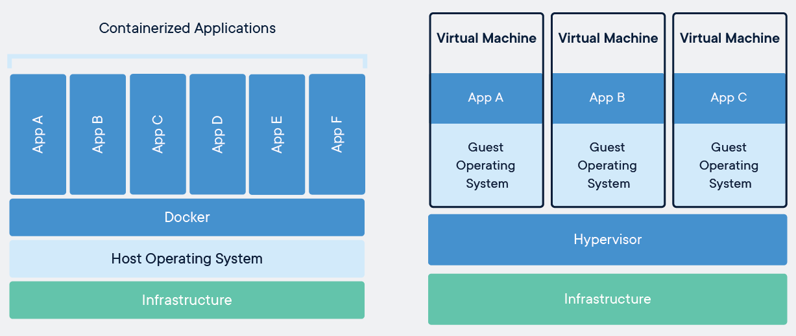
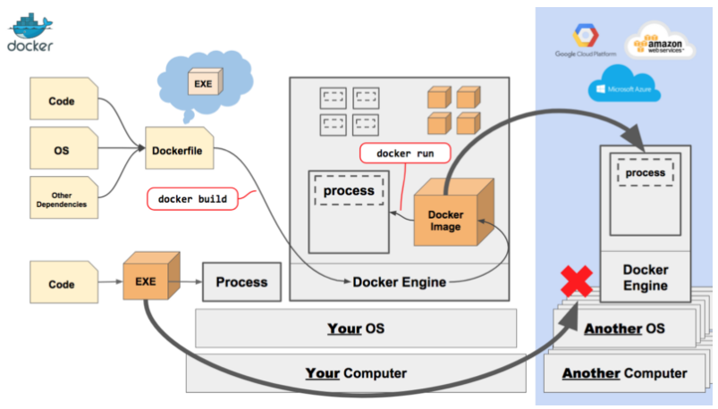
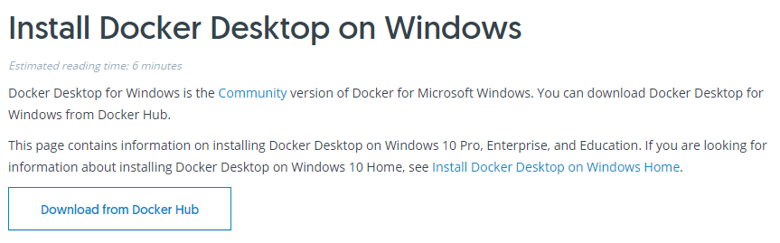
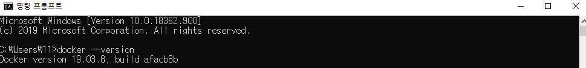
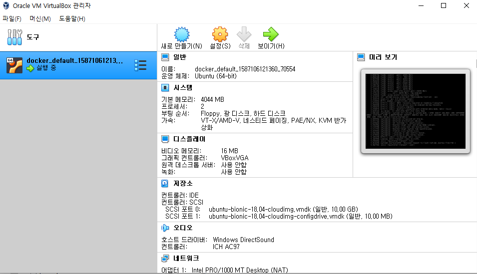

# 1. Docker

Docker는 Linux기반 Container Runtime 오픈소스로 Virtual Machine (이하 VM)보다 가벼운 형태로 배포 할 수 있는 것이 특징이다. 아래의 그림을 보며 VM과 Docker의 차이를 알아보자. VM의 경우 Host OS가 깔리고, 그 위에 Hypervisor 그리고 Virtual Machine이 만들어진다. 때문에 배포를 받는 경우 Host OS를 전부 받아야한다. 



> **Docker와 가상머신의 차이** | 출처: [도커 공식 홈페이지](https://www.docker.com/resources/what-container)


하지만 Container의 경우, Kernel등의 OS를 포함하지 않은채로 배포를 하는데 Kernel은 Host OS를 그대로 사용하며 Host OS와 Container OS의 다른 부분만 Container안에 담아 배포 하게 된다. 이러한 특징 때문에 Container에서 명령어를 수행하면 Host OS에서 명령어가 수행된다.


## 1.1 도커는 어떻게 동작하는가



> **도커의 동작** | 출처: [freecodecamp](https://www.freecodecamp.org/news/docker-quick-start-video-tutorials-1dfc575522a0/)


위 그림은 도커의 동작을 보여주는 좋은 예시이다. 도커는 위의 그림에서 보는바와 같이 Host OS를 기반으로 Docker Engine에 의해 동작하게 된다. 

도커의 동작을 이해하기 위해선 Docker Engine이 무엇을 다루는가를 보면 좋다. 먼저 배포를 할 때, 설치시 필요한 라이브러리, 소스, OS(Host와 Container OS의 차이를 담은) 데이터를 가진 Dockerfile이 만들어진다. 이후 build를 통해 Docker Image가 되며 우리는 Docker Image를 공유하며 간단하게 앱을 배포하고 설치할 수 있다.

Docker Image를 run하면 우리가 사용하는 Container가 만들어지고, 물론 하나의 Image로 여러개의 Container를 만들 수 있으며 이미지를 공유할 수 있는 [docker hub](https://hub.docker.com/)가 존재한다.

 

## 1.2 도커 설치

> Docker for Windows와 linux에서의 설치를 다룬다.

### 1.2.1 Docker for Windows

[도커 공식 홈페이지](https://docs.docker.com/docker-for-windows/install/)에서 Docker Desktop을 다운로드



> **Docker Desktop을 다운로드할 수 있는 페이지**


설치 이후에는 cmd나 shell을 통해 docker 명령어를 수행하면 된다. 설치 이후 버전을 확인해 설치가 제대로 되었는 지 확인하자.



> **도커의 버전**


### 1.2.2 linux

> Virtual Box를 기반으로 설치

#### git을 통해 docker를 설치

```bash
git clone https://github.com/dotcloud/docker.git
```


#### Virtual box 설치

[Virtual Box 공식 홈페이지](https://www.virtualbox.org/)에서 Virtual Box를 설치


#### Vagrant

> VM실행에 Vagrant를 사용해보자

Vagrant는 가상머신을 쉽게 Provisioning 할 수 있게 하는 툴로 생성과 관리시 사용한다. 가상머신의 Host name, IP, Service Install 등의 환경설정을 사용자의 요구에 맞게 할 수 있다.

- Vagrant를 사용하지 않는 경우 - 다수의 가상머신을 일일이 설정해주어야 함
- Vagrant를 사용하는 경우 - 가상머신에 대한 설정과 작업을 미리 정한 후 VirtualBox를 통해 Provisioning


##### 명령어

- vagrant init - vagrantfile을 생성
- vagrant up - provisioning 실행
- vagrant halt - 가상머신 종료
- vagrant destoy - 가상머신 삭제
- vagrant ssh - ssh로 접속
- vagrant provision - 가상머신의 설정을 변경


##### 사용법

- docker가 설치된 폴더로 이동

```bash
$ ls
docker
$ cd docker
```

- init명령어로 `vagrantfile`을 생성

```bash
$ vagrant init
A `Vagrantfile` has been placed in this directory. You are now
ready to `vagrant up` your first virtual environment! Please read
the comments in the Vagrantfile as well as documentation on
`vagrantup.com` for more information on using Vagrant.
```

- 생성된 `vagrantfile`을 에디터, 혹은 VScode로 열기

  > VScode 사용시 Extensions에서 `Vagrantfile Support`을 설치하면 가독성을 높일 수 있음

- 초기 15L에 위치한 `config.vm.box`는 가상머신의 OS이미지를 담는 변수로, Ubuntu를 사용할 할 경우 [Vagrant Cloud](https://app.vagrantup.com/boxes/search)에서 검색 후 이미지의 이름을 변수에 저장

```ruby
Vagrant.configure("2") do |config|
  config.vm.box = "ubuntu/bionic64"
  config.vm.synced_folder "../data", "/vagrant_data" # 가상머신과 Host간의 공유디렉토리 x
end
```

- 가상머신의 모든 기능을 사용하기 위해 plugin을 설치

```bash
$ vagrant plugin install vagrant-vbguest
```

- 가상머신 provisioning

    > 속도가 느릴 수 있으니 다양한 방식으로 시도
    >
    > - bash: $ vagrant plugin install vagrant-faster
    >
    >   bash: $ vagrant up
    >
    > - bash: $ wget {box url}
    
- provisioning 결과 (초기 `id`/`pwd`는 `vagrant`/`vagrant`)



