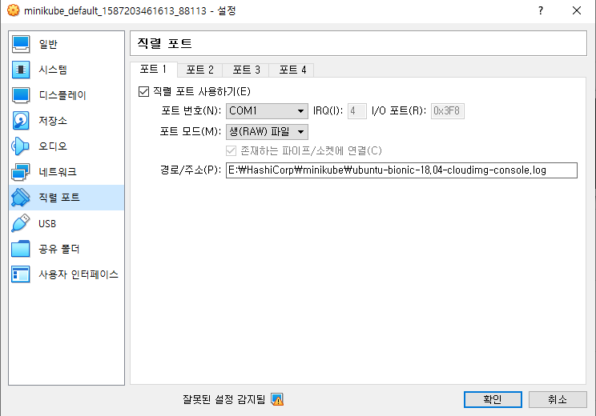

# 1. vagrant RawFile#0 에러

package한 box를 사용해 `vagrant up`할 때 다음과 같은 에러가 발생 할 수 있다.

```bash
Stderr: VBoxManage: error: RawFile#0 failed to create the raw output file /Users/ehankinson/Projects/leandog/atdd-linux-vagrant-master/ubuntu-xenial-16.04-cloudimg-console.log (VERR_FILE_NOT_FOUND)
VBoxManage: error: Details: code NS_ERROR_FAILURE (0x80004005), component ConsoleWrap, interface IConsole
```


이 에러는 vm에 직렬포트로 설정되어 있는 파일 (`Rawfile`)이 없어 생기는 오류인데, 해당 문서에서는 에러에 대한 두가지 방안을 제시한다. 사이트에서 받았던 box를 원본 박스, package한 box를 패키지 박스라고 하겠다.


# 1.1 consol.log 생성 후 사용

첫번째 방법은 `vagrant cloud`사이트에서 받았던 box를 이용해 `RawFile`을 만들어 적용하는 방법이다. 

- 원본박스를 이용해 `vagrant up`을 한다.
- 디렉토리에 `cloudimg_console.log`로 끝나는 파일이 생기는 것을 확인하고 provisioning을 중단한다.
- `RawFile`을 패키지 박스로 `vagrant up`하려는 디렉토리로 옮긴다
- 패키지 박스를 이용해 provisioning을 진행한다.
- provisioning이 끝난 후 Virtual Box를 실행한다.
- 만들어진 vm의 설정 - 직렬포트에 들어가 경로를 `RawFile`에 맞게 수정한다.




# 1.2 직렬포트 비활성화

- 패키지 박스를 이용해 provisiong을 한다
- 만들어진 vm의 설정 - 직렬포트에 들어가 `직렬 포트 사용하기`를 비활성화 한다.

> 1.2 방식의 경우 1.1보다 vm 부팅 시 오랜 시간이 걸리는 것을 확인하였음

