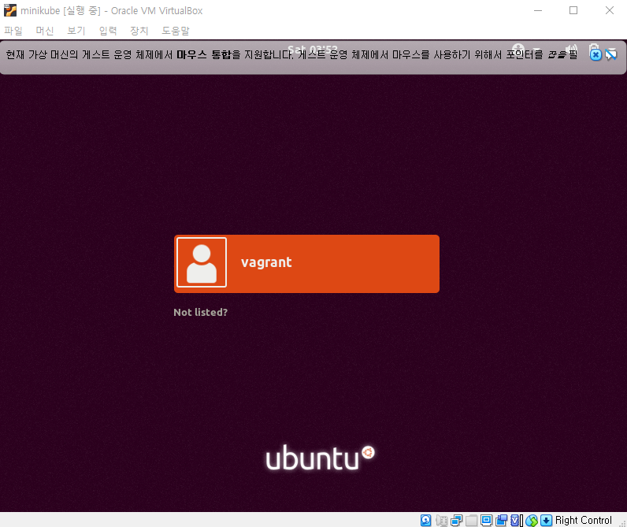

# 1. Vagrant box 만들기

다운로드 받은 box가 `gui`환경이 아닌 `tty`환경이기 때문에, 해당 box를 이용해 만든 vm에서 `gui` 환경을 만들고 box를 생성한다.


## 1.1 unity설치

- root계정으로 전환

```bash
$ sudo su
```

- `apt-get`을 업데이트

```bash
$ apt-get update
$ apt-get upgrade
```

- `ubuntu-desktop`을 설치

```bash
$ apt-get install ubuntu-desktop
```

- vm을 reboot

```bash
$ reboot
```

> 재부팅 후 `unity`로 변경된 환경을 확인 할 수 있다.




## 1.2 box생성

- 박스를 만들 디렉토리로 이동한다.
- 박스로 생성 할 vm의 이름을 확인한다.
- `package`명령어로 박스를 생성한다. (**박스의 이름에 `.box`확장자를 넣어야 함**)

```bash
$ vagrant package --ouput {box 이름} --base {vm 이름}
```


