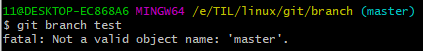
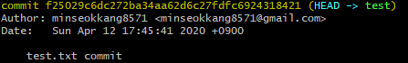
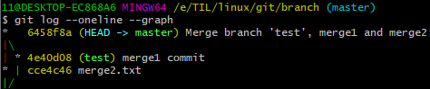

# 1. branch

깃의 협업에서 가장 중요한 요소인 브랜치에 대해서 알아본다. 브랜치는 독립적으로 작업을 하기 위한 개념으로 각각의 브랜치는 다른 브랜치의 영향을 받지 않기 때문에 동시에 여러 작업을 할 수 있게 되며 병합 (merge)라는 개념을 통해 하나의 브랜치로 만들 수 있다. 


## 1.1 명령어

- 생성

  ```bash
  $ git branch {브랜치명}
  ```

  브랜치 생성 시 최초의 commit을 하지 않은 경우 다음과 같은 에러가 발생한다. 



- 확인

  ```bash
  $ git branch
  ```

- 이동

  ```bash
  $ git checkout {브랜치명}
  ```

  브랜치의 생성과 동시에 이동하고 싶은 경우 다음과 같은 명령어를 사용한다.

  ```bash
  $ git checkout -b {브랜치명}
  ```

- 삭제

  ```bash
  $ git branch -d {브랜치명}
  ```

- 브랜치 병합

  ```bash
  $ git merge {브랜치명}
  ```


## 1.2 시나리오

브랜치를 활용할 시 일어날 수 있는 시나리오에 대해 알아본다.


### fast-foward

> master의 변화가 없는 채로 test브랜치에서 작업을 하고 commit을 함


- test 브랜치 생성 및 이동

  ```bash
  $ git checkout -b test
  ```

- 작업 후 commit, 임의의 파일 `test.txt`를 생성

  - commit 시점에서 commit log가 남음

    

- master이동

  ```bash
  $ git checkout master
  ```

- master에 test의 commit을 병합

  ```bash
  $ git merge test
  ```


### merge commit

> 서로 다른 commit을 병합하는  과정 (충돌x)


- test에서 작업 후 commit, 임의의 파일 `merge1.txt`를 생성

- master로 이동

  ```bash
  $ git checkout master
  ```

- master에서 작업 후 commit, 임의의 파일 `merge2.txt`를 생성

- master에 test의 commit을 병합

  ```bash
  $ git merge test
  ```

- 자동으로 merge commit이 생성되며, 편집기 환경에서 commit이름을 수정가능

- 그래프 확인

  ```bash
  $ git log --oneline --graph
  ```

  

  **위의 그래프를 보면 두개의 분기로 나눠진 후 하나로 병합되는 것을 확인할 수 있음!**


### merge commit 충돌

> 서로 다른 commit을 병합하는 과정에서 같은 이름의 파일이 수정된 경우, 충돌이 발생


- auto-merging에 실패하기 때문에 직접 파일을 변경시켜주어야함. 이 때 git status 명령어로 충돌 파일을 확인 할 수 있음

- 파일 hotfix 후 merge commit 실행

  ```bash
  $ git commit
  ```

- 그래프 확인

