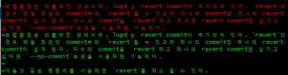
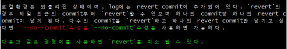

# 1. diff

해당 문서에서는 커밋 간 또는 HEAD와 워킹 디렉토리의 변경, 차이점을 알 수 있는 명령어인 `diff`에 대해 설명한다.


## 1.1 가독성 높이기

`diff`를 설정없이 그냥 사용 할 경우, 가독성이 낮아 무엇이 파일이고 변경점인지를 알아보기가 힘들다.

git에서는 가독성을 높일 수 있는 옵션을 추가로 제공한다.


- 옵션 미사용: 실제 변경점보다 큰 범위가 표시되어 알아보기 힘들다.

```bash
$ git diff
```




- `--color-words`: 변경 된 단어들을 빨강, 변경 후 단어들을 초록으로 표시한다.

```bash
$ git diff --color-words
```




- `--word-diff`: 변경점을 좀 더 명시적으로 표시한다.

```bash
$ git diff --word-diff
```


## 1.2 비교하기

`diff` 명령어의 경우 사용방식에 따라 다양한 환경을 비교할 수 있다.


- unstaged 변경사항 확인

```bash
$ git diff
```

- staged 변경사항 확인

```bash
$ git diff --staged
```

- 마지막 commit과 변경사항 확인

```bash
$ git diff HEAD
```

- 마지막 commit과 그 이전 commit확인

```bash
$ git diff HEAD HEAD^
or
$ git diff HEAD HEAD~1
```

- commit 간 비교

```bash
$ git diff {commit hash} {commit hash}
```

- 원격 저장소와 워킹 디렉토리 비교

```bash
$ git diff origin/{branch명}
```


