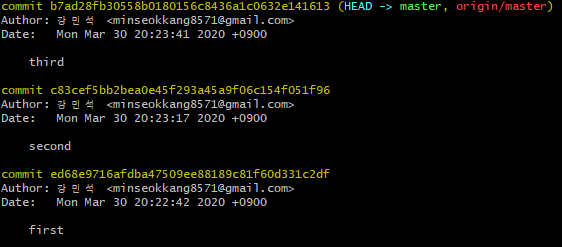
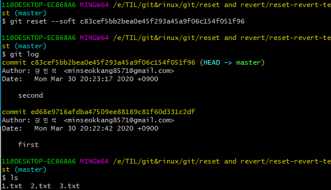
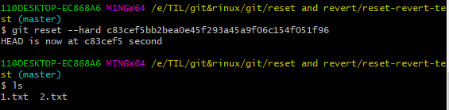
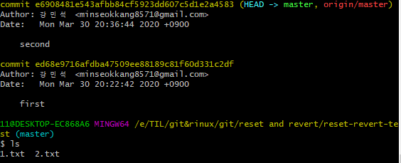
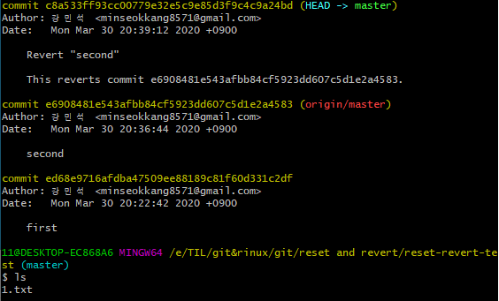

# 1. commit 되돌리기

이미 `push`를 해버린 commit를 되돌리는 방법은 두가지로  `reset` ,`revert` 명령어를 사용한다.  


## 1.1 reset

`reset`의 경우 원격저장소의 시간을 되돌리는 방법으로, 돌아가려는 commit으로 원격저장소는 재설정되고 commit의 이력은 사라진다. 




​			위와 같은 상황에서 진행.

- `reset --soft`: 이력은 돌려지나 이력 이후의 로컬내용은 변경되지 않음



- `reset --hard`: 이력과 로컬내용 모두 변경됨



git의 해쉬의 경우 `HEAD ~{돌아가고 싶은 이력의 수}`로 상대적 지정도 가능하다.


## 1.2 revert

commit을 되돌리는 것을 하나의 commit으로 간주해 log에 추가하는 명령어




`git revert e6908481e543afbb84cf5923dd607c5d1e2a4583 # Revert second` 와 같은 명령어를 입력하므로서 다음과 같은 결과를 얻을 수 있다.



로컬환경은 되돌려진 상태이며, log에는 revert commit이 추가되어 있다. `revert`의 경우 제일 최근의 commit부터 `revert`할 수 있으며 하나의 commit당 하나의 revert commit이 남게 된다. 다수의 commit을 `revert`하고 하나의 revert commit만 남기고 싶다면 `--no-commit`속성을 사용하면 가능하다.

다음과 같은 명령어를 사용하면 `revert`를 취소 할 수 있다.

```bash
$ git revert --abort
```


## 1.3 사용

`reset`의 경우 다수가 사용하는 원격저장소에서 사용하는 것은 추천되지 않는다,

- 혼자 사용하는 원격저장소
- 아직 `push` 하기 전

과 같은 상황에서 사용하며 그 외의 상황에선 `revert`를 사용하도록 한다.