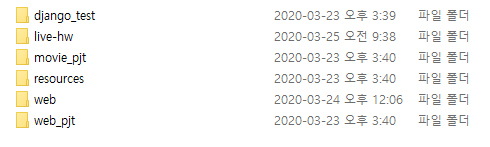

# 1. 여러 git repository 한꺼번에 명령어 적용하기


다음과 같은 폴더 구조에서 하위 폴더 역시 git repository일 때 한번에 명령어를 적용하는 방법에 대해 알아본다.



## 1.1 ls 명령어

`ls` 명령어를 통해 디렉토리 목록을 확인 할 수 있다.

```bash
$ ls
django_test/  live-hw/  movie_pjt/  resources/  web/  web_pjt/
```


## 1.2 xargs 명령어

xargs 명령어는 바로 앞의 명령어의 결과를 받아 for each처럼 사용 할 수 있게 하는 명령어로 다음과 같이 사용할 수 있다.

```bash
$ ls | xargs ls
django_test/:
accounts  boards  django_fbv  manage.py  requirements.txt

live-hw/:
daily  elearning  README.md  추가자료

movie_pjt/:
accounts  db.sqlite3  manage.py  movie_pjt  movies

resources/:

web/:
bootstrap  flex.md  flex-template  images  index.html  README.md

web_pjt/:
01_nav.css     02_footer.html  04_community.css   style.css
01_nav.html    03_home.css     04_community.html  Web_PJT.pdf
02_footer.css  03_home.html    images
```

위의 코드는 **1.1**의 결과인 폴더들을 하나씩 인자로 가져온 후 `ls`명령어를 적용한 것이다. 해당 명령어를 이용하여 하위 폴더에 git 명령어를 적용 시킬 수 있다.


## 1.3 다른 경로에서 git 명령어 사용하기

현재 경로가 아닌 다른 경로에서 git 명령어를 적용하기 위해서는 다음과 같은 명령어를 사용해야 한다.

```bash
git -C {상대경로|절대경로} {명령어}
```


## 1.4 xargs: -I 옵션

xargs는 기본적으로 값을 명령어 제일 뒤에 붙여 실행한다. 값이 적용되는 위치를 변경하기 위해 해당 옵션을 사용한다.

```bash
#옵션 미적용
$ ls | xargs git -C {} pull origin master
-> git -C pull origin master web_pjt
#옵션 적용 ({}를 관습적으로 사용)
$ ls | xargs -I{} git -C {} pull origin master
-> git web_pjt pull origin master
$ ls | xargs -IR git -C R pull origin master
-> git web_pjt pull origin master
```


## 1.5 최종 명령어

위의 요소들을 모두 적용하여 다음과 같은 명령어를 만들 수 있다.

```bash
ls | xargs -I{} git -C {} status
```


# 2. 참조

이 문서는 해당 [링크]([http://tech.javacafe.io/2018/12/15/%EC%97%AC%EB%9F%AC_git_%EB%A6%AC%ED%8C%8C%EC%A7%80%ED%86%A0%EB%A6%AC_%ED%95%9C%EA%BA%BC%EB%B2%88%EC%97%90_git_%EB%AA%85%EB%A0%B9%EC%96%B4_%EC%A0%81%EC%9A%A9%ED%95%98%EA%B8%B0/](http://tech.javacafe.io/2018/12/15/여러_git_리파지토리_한꺼번에_git_명령어_적용하기/))를 참조했음.


