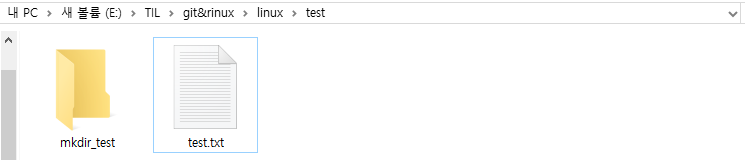

# 1. linux 기본 명령어1

linux의 기본 명령어에 대해 알아본다. **명령어를 외우기 위해 무엇의 약자인지 꼭 기억하도록 하자.** 환경은 window의 git bash에서 실행하였다. 해당 문서에 작성된 명령어는 다음과 같다.
1. ls

2. cd

3. mkdir

4. touch

5. mv

6. rm

7. cp

8. cat

   


## 1.1 ls (list segments)

현재 위치의 파일 목록을 조회한다.


```bash
11@DESKTOP-EC868A6 MINGW64 /e/TIL/git&rinux/linux/test (master)
$ ls
test.txt
```


옵션

- ls -l: 파일들의 상세정보를 나타냄
- ls -t: 최근에 만들어진 파일부터 표시함
- ls -a: 숨겨진 파일도 표시함


## 1.2 cd (change directory)

경로(디렉토리)를 이동한다. 아래 옵션들은 모두 중요하니 외우도록 함.


옵션

- cd ~: 홈디렉토리로 이동
- cd ..: 상위 디렉토리로 이동
- cd {dir}: 해당 경로로 이동


## 1.3 mkdir (make directory)

새로운 디렉토리를 생성한다.

```bash
11@DESKTOP-EC868A6 MINGW64 /e/TIL/git&rinux/linux/test (master)
$ mkdir mkdir_test
```




옵션

- mkdir -p {}/{}: 존재하지 않는 디렉토리의 하위 디렉토리까지 생성

  ```bash
  $ mkdir -p mkdir_test2/in
  
  $ ls
  mkdir_test/  mkdir_test2/  test.txt
  
  11@DESKTOP-EC868A6 MINGW64 /e/TIL/git&rinux/linux/test (master)
  $ cd mkdir_test2
  
  11@DESKTOP-EC868A6 MINGW64 /e/TIL/git&rinux/linux/test/mkdir_test2 (master)
  $ ls
  in/
  ```


## 1.4 touch

새로운 파일을 생성한다.

```bash
$ ls
mkdir_test/  mkdir_test2/  mkdir_test3/

$ touch touch_test.txt

$ ls
mkdir_test/  mkdir_test2/  mkdir_test3/  touch_test.txt
```


## 1.5 mv (move)

파일을 이동하는 명령어로 원본이 옮겨진다.


```bash
$ ls
mkdir_test/  mkdir_test2/  mkdir_test3/  test.txt

$ mv test.txt mkdir_test/test.txt

$ ls
mkdir_test/  mkdir_test2/  mkdir_test3/

$ cd mkdir_test

$ ls
test.txt
```


옵션

- mv -b {fname} {mfname}:  파일이 이미 존재하면 mfname을 백업한 뒤에 이동
- mv -f {fname} {mfname}: 파일이 이미 존재하면 백업 없이 덮어씀


## 1.6 rm (remove)

파일이나 디렉토리를 삭제한다.

```bash
$ ls
test.txt

$ rm test.txt

$ ls

```


옵션

- rm -f {fname}: fname을 묻지 않고 삭제함
- rm -r {dir}: dir을 삭제함


## 1.7 cp (copy)

파일을 복사한다.

```bash
$ ls
mkdir_test/  mkdir_test2/  mkdir_test3/

$ touch test.txt

$ ls
mkdir_test/  mkdir_test2/  mkdir_test3/  test.txt
```


## 1.8 cat (catenate)

파일의 내용을 인자로 받아 출력한다.

```bash
$ cat touch_test.txt
dddddddddddddddddd
dddddddddddddddddd
dddddddddddddddddd
```


옵션

- cat {fname1} {fname2}: fname1과 fname2의 내용을 이어서 출력함

```bash
$ cat touch_test.txt cat_test.txt
dddddddddddddddddd
dddddddddddddddddd
dddddddddddddddddd
ccccccccccccccccccccccccccccccccccccccccccc
ccccccccccccccccccccccccccccccccccccccccccc
ccccccccccccccccccccccccccccccccccccccccccc
```

- cat {fname1} {fname2} | more: 페이지별로 출력함

