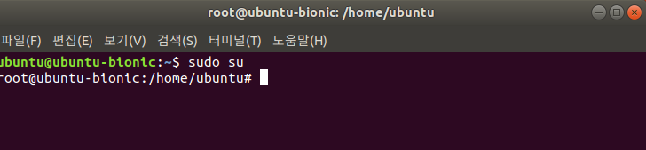
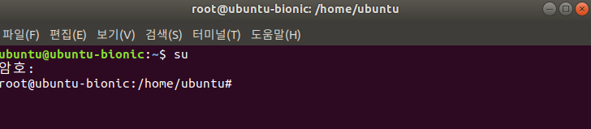
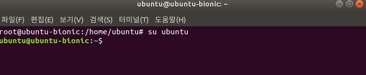
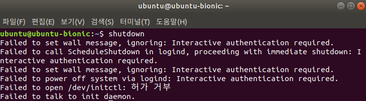
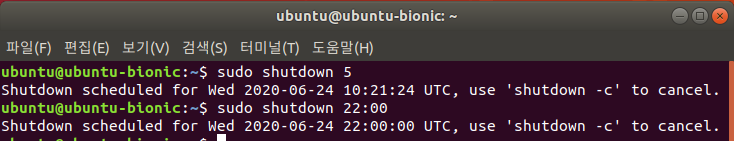
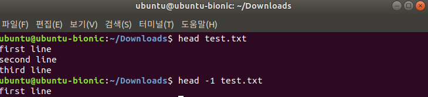
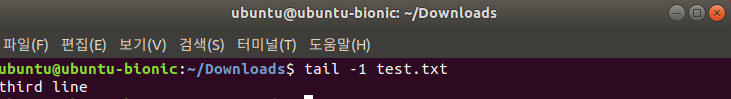
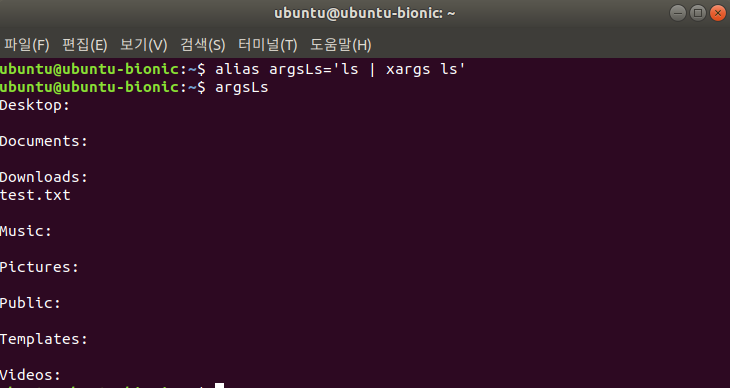
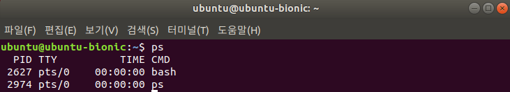
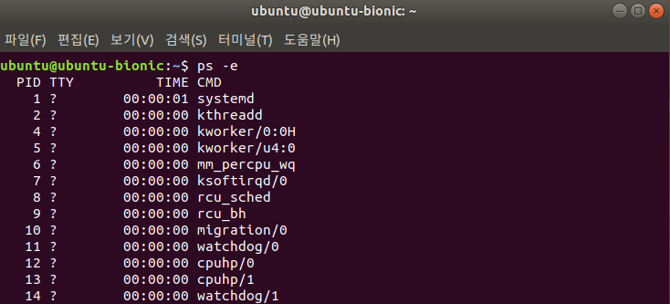

# 1. linux 기본 명령어2

linux의 기본 명령어에 대해 알아본다. 환경은 Virtual Box의 Ubuntu 18.04에서 진행.

해당문서에서 다루는 명령어는 다음과 같다.

1. sudo
2. su
3. shutdown
4. head
5. tail
6. alias
7. ps
8. kill


## 1.1 sudo

사용자에게 root에 준하는 능력으로 명령을 실행 할 권한을 주는 명령어

```bash
$ sudo {명령어}
```


권한이 지속적으로 필요할 경우 다음의 명령어를 사용한다. `su`에 대한 정보는 1.2에 기술한다.



> **root로의 사용자전환**


## 1.2 su (switch user)

사용자를 전환할 때 사용하는 명령어

```bash
$ su {사용자}
```


default는 root로 1.1의 `sudo su`와 달리 암호를 요청하는 것을 볼 수 있다. 1.1의 경우 사용자 전환 자체를 root의 권한으로 했음을 알 수 있다.



> **su의 default 전환**




> **su를 이용한 사용자전환**


## 1.3 shutdown

리눅스 시스템을 종료하는 명령어

```bash
$ shutdown {시간}
$ shutdown -r # 시스템을 재시작
$ shutdown -P # 강제로 시스템 종료
$ shutdown -c # shutdown 스케줄 제거
```


시스템을 강제로 종료하는 명령어인 만큼 **오직 root**권한으로만 실행 할 수 있다.



> **root외 사용자가 shutdown을 실행했을 시의 에러**


시스템을 언제 종료할지를 옵션으로 가지는데 `5`와 같이 단순 숫자를 사용할 때는 분의 의미를 갖고, 10시에 종료하고 싶을 경우는 `22:00`과 같이 작성하면 된다.



> **서로 다른 방식의 시간표기** **(UTC)**


## 1.4 head

파일의 내용을 출력해주는 명령어

```bash
$ head {파일명}
```


10줄을 default값으로 가지며 `-2`와 같이 변경 할 수 있다.



> **head의 라인 옵션**


## 1.5 tail

`head`와 달리 파일의 내용을 뒤에서 부터 출력해주는 명령어

```bash
$ tail {파일명}
```


역시 10줄을 default값으로 가지며 `-{숫자}`로 변경 할 수 있다.



> **tail의 결과값**


## 1.6 alias

자주 사용하는 명령어를 별칭으로 저장하는 명령어

```bash
$ alias {별칭}='{명령어}'
$ alias # alias list
$ unalias {명령어} # alias 삭제
$ unalias -a # 모든 alias 삭제
```




> **alias의 예시**


## 1.7 ps

현재 실행중인 프로세스를 확인하는 명령어

```bash
$ ps
$ ps -e # 자세한 정보 출력
$ ps -u {사용자명} # 특정 사용자의 정보 출력
```


옵션 없이 사용하면 현재 터미널에서 실행한 사용자 프로세스 정보를 제공한다. `PID`는 프로세스 넘버, `TTY`는 터미널 정보이다.



> **ps의 예시**


`-e` 명령어를 통해 더 자세한 정보를 출력 할 수 있다.




## 1.8 kill

프로세스를 종료시키는 명령어

```bash
$ kill {PID}
```

