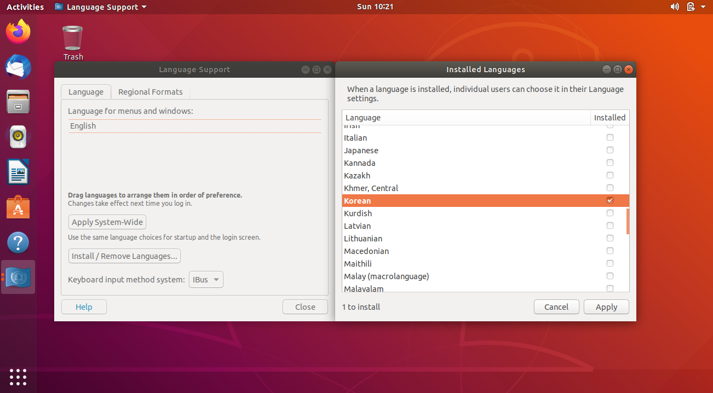
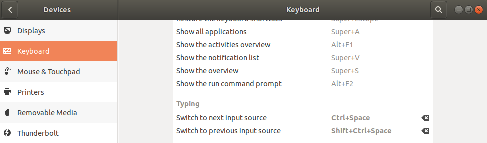
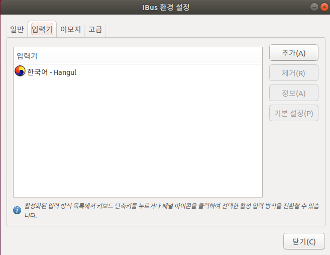
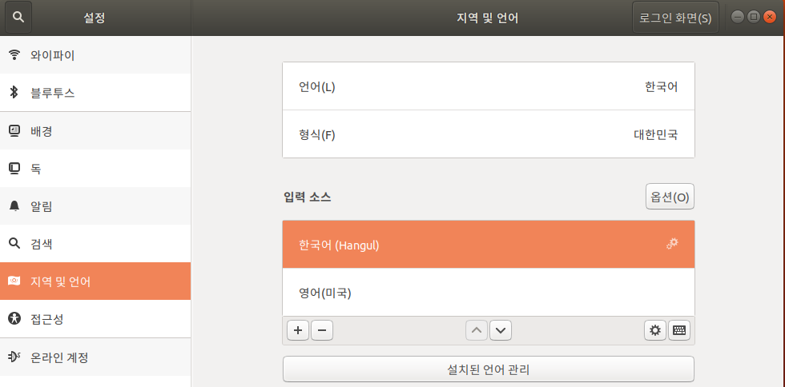
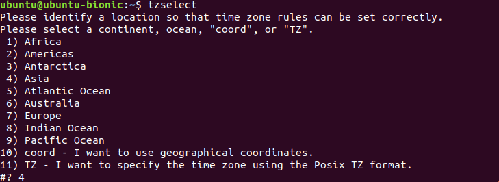
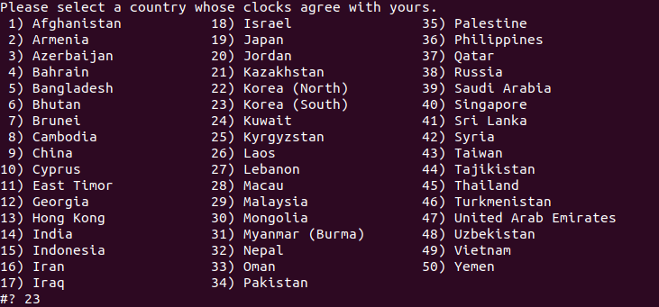

# 1. ubuntu 기초 세팅

> vm에 ubuntu를 설치 한 후 기본적으로 할만한 세팅에 대해 다룬다.

1. vim 설치 및 세팅
2. 한/영 전환
3. 윈도우와 시간 맞추기


## 1.1 vim 설치 및 세팅

> 문서를 손쉽게 조작하기 위해 vim을 설치한다.

- vim설치

```bash
$ sudo apt-get install vi
```

- 설정 파일 생성

```bash
$ vi ~/.vimrc
```

- 설정 파일 세팅 

```bash
# .vimrc

set number
set ai
set si
set shiftwidth=4
set ts=4
set hlsearch
set bs=indent,eol,start
set nocompatible
set showmatch
```


## 1.2 한/영 전환

> 한글을 사용하기 위해 한글팩을 설치하고 한/영 전환이 가능하도록 세팅한다.

- 한글팩 설치

  - `시작` -> Language Support -> Install/Remove Languages -> Korean

  

- 한/영 전환 단축키 설정

  - `시작` -> keyboard -> Typing -> Switch to next input source

  

- 시스템 reboot

```bash
$ reboot
```

- ibus 환경 설정 -> 입력기 -> `한국어 - Hangul`추가 

```bash
$ ibus-setup
```




- 시스템 상 한글 등록

  - `시작` -> Region & Language
  - Language를 `한국어`, Formats를 `대한민국`으로 변경
  - Input Sources의 `+`를 눌러 `한국어 (Hangul)`로 변경하고 최상위로 올림

  

- 시스템 reboot


## 1.3 윈도우와 시간 맞추기

> ubuntu의 초기 시간은 UTC기준이기 때문에 추가적인 설정이 필요하다.

- timzone 설정 명령어

```bash
$ tzselect
```

- 국가에 맞게 번호를 선택 (우리나라의 경우 `4` -> `23`)



