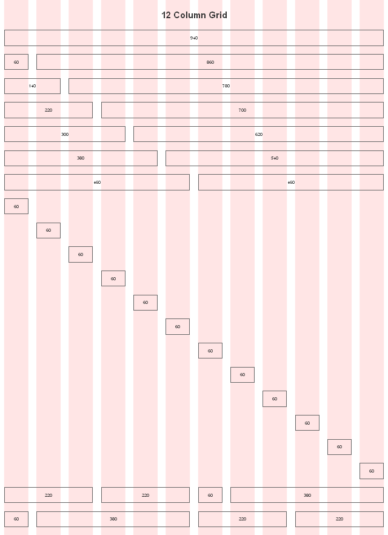
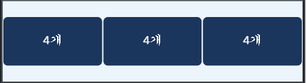
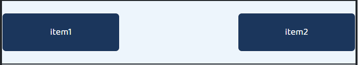
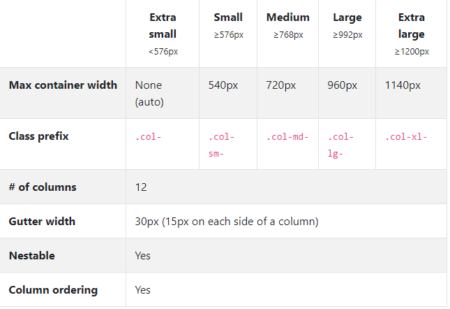

# 1. grid

웹 디자인을 규격화하고 나아가 반응형으로 만들기위해 grid(격자) 모델을 사용한다.


## 1.1 12 column grid

grid모델은 웹 디자인 이전에도 있었던 개념으로 12 column grid는 한 행이 12개의 열로 나뉘는 형태를 의미한다. 12개의 열로 나누는 이유는 12라는 숫자가 1, 2, 3, 4, 6과 같은 다양한 약수를 가지는 수이기 때문이다. 




## 1.2 bootstrap grid

부트스트랩에선 grid를 구현하기위해 `container`라는 클래스를 사용한다. `container`는 `flex`로 구현이 되어 있기 때문에 `flex`의 속성을 사용할 수 있고 이로 인해 유연한 레이아웃 구성이 가능하다.

`container`의 내부는 `row`와 `col`로 구성된다. 하나의 `row`는 12크기의 `column`으로 구성되며 각 요소(열)의 사이즈를 정하여 사용할 수 있다. 다음 예시를 보자.

```html
<div class="container">
  <div class="row">
    <div class="item col-4">
      <p>4개</p>
    </div>
    <div class="item col-4">
      <p>4개</p>
    </div>
    <div class="item col-4">
      <p>4개</p>
    </div>
</div>
```



위의 예시는 하나의 `container`, `row`로 구성되어있으며 이 `row`는 각각 4의 크기를 가지는 `col`로 구성된다.


### offset

행을 꽉 채우지 않고 빈 칸을 두기 위해서는 `offset`을 사용할 필요가 있다. `offset`을 사용하면 다음과 같은 레이아웃을 구성 할 수 있다.

```html
<div class="row">
    <div class="item col-4">
      <p>item1</p>
    </div>
    <div class="item col-4 offset-4">
      <p>item2</p>
    </div>
</div>
```



class명은 기본적으로 `col`의 클래스 적용에서 `col`을 `offset`으로 치환하면 된다. `offset`의 경우 클래스를 적용한 열의 앞에 공백이 생기므로 주의하도록 하고 반응형 웹 제작시 범위에 따른 적용여부도 확인해야한다. 


## 1.3 반응형 웹

부트스트랩에선 grid를 사용하여 웹의 너비에 따라 다른 크기를 가지는 반응형 웹을 제작할 수 있다. 웹의 크기에 따른 속성은 다음과 같다.



[^https://getbootstrap.com/docs/4.4/layout/grid/]: 출처

적용은 `col-sm-4`와 같이 사용하며 576보다 큰 pixel에서는 해당 열이 4의 크기를 가진다는 의미가 된다. 각 클래스들은 기준보다 큰 경우 적용되기 때문에 pixel이 큰 환경부터 적용하면 편리하다.


# 2. bootstrap class

부트스트랩에서는 웹을 디자인하기 위한 편리한 class들이 존재한다. 웹 제작에서 자주쓰이는 세가지를 기술한다.


- card: 카드는 이미지와 설명을 넣을 수 있는 박스로 레이아웃을 심플하게 꾸밀 수 있게 해준다.
- modal: 모달은 버튼을 눌렀을 때 팝업을 띄워준다. 버튼외에 다른 요소들이 눌렸을 때 이벤트를 트리거하기 위해선 해당 요소를 버튼으로 감싸거나 `data-toggle="modal" data-target="#exampleModal"` 부분을 원하는 요소로 옮겨주면 된다.
- carousel: 캐루젤은 회전목마라는 뜻으로 좌우 버튼을 누르거나 일정 시간이 지나면 이미지가 변경되는 배너이다.

