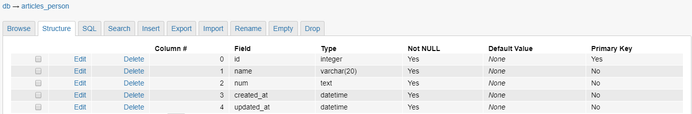

# 1.model

django의 **MTV**의 M에 해당하는 model은 db를 읽고 쓰는 부분에 해당한다. 우리는 model을 이용해 sql테이블을 생성하고 template을 통해 입력을 받으며 view를 통해 사용자에게 보여 줄 수 있게된다.


## 1.1 모델 등록

model의 정의는 프로젝트 디렉토리에 위치한 `models.py`에서 이루어진다. 우리는 원하는 테이블을 class의 형태로 정의하여 사용할 수 있다.

```python
# models.py
from django.db import models

class Person(models.Model):
    name = models.CharField(max_length=20)
    num = models.TextField()
    created_at = models.DateTimeField(auto_now_add=True)
    updated_at = models.DateTimeField(auto_now=True)
```


위와 같이 class를 정의 한 후, 장고에 모델을 등록해야한다. 다음 명령어를 수행하면 프로젝트 디렉토리의 `migrations`폴더에 우리가 만든 class의 migrations이 추가된 것을 확인 할 수 있다.

```bash
$ python manage.py makemigrations
```


현재 상태는 git에서의 staged상태와 비슷하며 실제 db에 migration을 적용하기 위해서는 다음과 같은 명령어를 수행해야 한다.

```bash
$ python manage.py migrate
```


db를 확인하면 다음과 같은 테이블이 생성된 것을 확인 할 수 있다.




## 1.2 테이블 class의 사용

우리는 ORM을 통해 db를 사용하므로 테이블을 클래스의 형태로 사용할 수 있다. 즉, db를 CRUD (Create Read Update Delete)하기 위해 객체를 만들어 사용한다는 의미이다.

- update

    ```python
    person = Person()
    person.name = "강민석"
    person.num = "010-2523-8571"
    person.save()
    ```
    
    위와 같이 객체를 만들어 테이블에 접근하며, 저장을 위해서는 `save`메소드를 사용해야 한다.
    
- read

    ```python
    persons = Person().object.all()
    ```


## 1.3 admin 등록

django의 가장 큰 장점인 admin페이지에 모델을 등록하여 관리할 수 있다. 이를 위해선 먼저 관리자를 등록해주어야 한다.

```bash
$ python manage.py createsuperuser
```


아이디 및 비밀번호 등록을 마치고 난 후, 서버의 /admin/ 루트를 통해 관리자 페이지에 접근할 수 있다. 앞서 등록한 계정정보로 로그인을 하고 나면 django 관리 페이지에서 `인증 및 권한`을 수정할 수 있는 것을 확인 할 수 있다. 

해당 페이지에서 모델 class를 관리하기 위해서는 추가적인 설정이 필요하다. 방법은 간단한데 `admin.py`에 원하는 모델 class를 등록해주면 된다.

```python
# admin.py
from django.contrib import admin
from .models import Review
# Register your models here.

admin.site.register(Review)
```


위와 같이 수정을 한 후 관리자 페이지를 확인하면 Review 테이블을 우리가 관리 할 수 있음을 확인 할 수 있다.


# 2.django_extensions

db를 손쉽게 조작하기위해 서드파티 앱인 django_extensions를 사용한다. 이를 사용하기 위해서는 local app과 마찬가지로 `settings.py`의 `INSTALLED_APPS`에 **django_extensions**를 추가해주어야 한다. (django-extensions가 아님에 주의한다)

- 설치

  ```bash
  $ pip install django-extensions ipython
  ```

- 실행

  ```bash
  $ python manage.py shell_plus
  ```

  