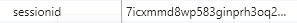
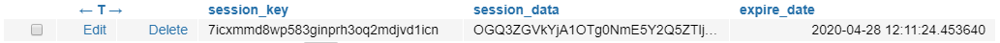

# 1. login & logout

django는 `userform`을 통해 회원가입을 한 사용자를 대상으로 login과 logout 기능을 손쉽게 사용할 수 있도록 모듈을 제공한다. 


## 1.1 쿠키와 세션

login기능에 대해 설명하기에 앞서 웹상에서 login이 가지고 있는 의미가 무엇인지, 어떤 방식으로 동작하고 있는지를 이해하기 위해 쿠키와 세션에 대해 알 필요가 있다.

쿠키와 세션이 만들어진 배경은 `HTTP`라는 프로토콜의 특성에서 부터 나온다. HTTP는 **connectionless**, **stateless**라는 특징을 가지는데, connectionless는 요청과 응답에 의한 사용자 - 서버 간 통신이 이루어진 후 더 이상의 연결 (connection)이 없이 통신이 끊기는 것을 의미하며. stateless는 통신이 끊긴 후 상태 정보를 유지하지 않는 특성이다.

위의 두가지 특성 때문에 사용자는 연속적인 행위를 할 수가 없게 된다. 예를들어 소셜커머스에서 물건을 사기위해 로그인을 했다면, 다른 물건을 살 때 다시 로그인을 할 필요가 있게 된다. 이러한 단점을 쿠키와 세션으로 해결 할 수 있다.


### 쿠키

- 클라이언트 (브라우저)에 저장되는 키와 값이 있는 데이터 파일
- 클라이언트의 정보를 로컬에 저장하고 참조
- 사용자 인증의 유효시간을 명시할 수 있으며, 유효 시간이 정해지면 브라우저가 종료된 후에도 삭제되지 않음 -> 인증 유효시간을 명시한 경우 브라우저가 종료되도 삭제되지않음
- 브라우저의 request헤더에 포함되어 전송

### 세션

- 사용자 정보를 서버에 저장하는 데이터 파일
- 클라이언트를 구분하기위해 session id를 사용하며, 인증상태를 유지할 수 있게 함
- 쿠키보다 보안이 좋지만 서버의 메모리를 사용하게 됨

### 작동방식

- 사용자가 request를 보냄
- 서버에서 사용자의 정보를 토대로 세션id를 발급
- 서버에서 쿠키를 담아 response


우리는 쿠키와 세션을 이용하여 **인증**을 하고 이를 유지하면서 지속적인 연결을 하는 것처럼 서비스할 수 있다.


## 1.2 AuthenticationForm

먼저 로그인, 로그아웃 동작을 위해 import할 모듈들은 다음과 같다. `AuthenticationForm`은 사용자 인증을 받는 form으로  `modelForm`이 아닌 `Form`을 상속 받는 것이 특징이다.

```python
from django.contrib.auth.forms import AuthenticationForm
from django.contrib.auth import login as auth_login
from django.contrib.auth import logout as auth_logout
```


다음으로 로그인 동작을 위한 함수를 보자.

```python
# views.py
def login(request):
    if request.method  == 'POST':
        form = AuthenticationForm(request, request.POST)
        if form.is_valid():
            auth_login(request, form.get_user())
            return redirect('accounts:index')
    form = AuthenticationForm()
    context = {
        'form': form,
    }
    return render(request, 'accounts/login.html', context)
```


다음 코드를 보면 그동안 사용했던 `modelForm`과는 다른 매개변수를 가지는 것을 확인 할 수 있다. 해당 코드는 사용자로부터 받은 로그인 정보를 form 인스턴스의 형태로 만드는 코드인데,  사용자 인증을 위한 정보를 request에서 꺼내기 위해 매개변수로 넘겨주어야 한다.

```python
form = AuthenticationForm(request, request.POST)
```


form의 유효성을 검증한 후, `login`함수를 이용해 로그인을 한다. 이 때 auth_user모델을 `form.get_user`함수를 사용하여 반환한다.

```python
auth_login(request, form.get_user())
```


로그인 절차가 끝나면 브라우저를 통해 세션id를 발급받은 쿠키가 생성되었음을 확인 할 수 있다.

- 쿠키

  

- 세션

  


로그아웃은 세션의 사용자 관련 레코드를 제거하면서 이루어지며 django에서 제공하는 logout함수를 사용하면 간단하다.

```python
def logout(request):
    auth_logout(request)
    return redirect('accounts:index')
```


## 1.3 로그인 상태에 따른 분기

웹페이지에서 로그인을 하면 사용자 ID를 보여주며 login버튼이 logout으로 바뀌는 것을 볼 수 있다. 우리는 이를 구현하기위해 로그인 상태에 따라 분기를 나눈다.

- html

  ```html
  
  ```

- python

  ```python
  if request.user.is_authenticated:
  ```

  