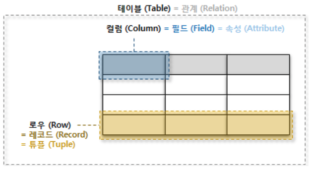

# 1. SQL

SQL (Structed Query Language)는 RDBMS (Relational Data Base Management System)에 질의를 해 원하는 데이터를 응답받는 언어이다.

해당 문서에서는 간단한 관계형 데이터베이스의 구조와 SQL에 대해 다룬다.


## 1.1 관계형 데이터베이스

관계형 데이터 베이스는 관계를 열과 행으로 이루어진 테이블 집합으로 구성한다. 이 때 열은 `레코드`라고 하며 데이터의 값을 의미하고, 행은 `필드`라고 하며 데이터의 속성을 나타낸다. 또한 `필드`와 `레코드`의 관계로 인해 `테이블`이라는 구조 (structure)가 만들어진다.




관계형 데이터 베이스에서는 이 관계를 이용해서 질의를 진행하게 된다. 예를들어 학생부라는 `테이블`에 학번이 적혀있고 인적사항이 적혀있다면 학번이라는 `필드`를 이용해 그 학생의 정보를 알 수 있는 것이다.

> 33번 학생의 인적사항을 가져와줘


여기서 말하는 학번이라는 개념은 각 학생들이 가지고 있는 고유한 값이다. 같은 학번을 가진 학생은 존재하지 않기 때문에 우리는 질의를 할 때 해당 필드를 자주 사용하게 된다. 이러한 필드를 `primary key` 혹은 `기본키`라고 한다.


## 1.2 SQL

SQL은 다음과 같이 나눌 수 있다. 데이터베이스를 정의하고 테이블 단위에서의 조작을 하는  `DDL (Data Definition Language)`, 정의된 데이터베이스 내에서 조작을 하는 `DML (Data Manipulation Language)`, 데이터베이스의 접근 권한에 대한 `DCL (Data Control Language)`

SQL을 사용할 때는 `trailing comma`를 사용하지 않으며, 쿼리문에 마지막에 `;`을 붙여주도록 한다.


### DDL

- CREATE: 데이터베이스, 테이블을 생성

```SQLITE
CREATE TABLE persons (
	student_id INTEGER PIMARY KEY,
    name TEXT NOT NULL,
    gender TEXT NOT NULL,
    address TEXT NOT NULL
);
```

- ALTER: 테이블을 수정

```sql
ALTER TABLE persons RENAME TO students;
```

- DROP: 데이터베이스, 테이블을 삭제

```sql
DROP TABLE students;
```

- TRUNCATE: 테이블을 초기화

```sql
TRUNCATE TABLE students;
```


### DML

- SELECT: 데이터를 조회

```SQL
-- 학생들의 모든 정보를 조회 (* == 모든) --
SELECT * FROM students;

-- 학생들의 이름만을 조회 --
SELECT name FROM students;

-- 이름이 tom인 학생의 모든 정보를 조회 --
SELECT * FROM students WHERE name = 'tom';

-- 학생들의 모든 정보를 학번 내림차순 (DESC <-> ASC)으로 조회 --
SELECT * FROM students ORDER BY student_id DESC

-- 학생들의 모든 정보를 이름 내림차순 2명만 조회 --
SELECT * FROM students ORDER BY name DESC LIMIT 2

-- 성이 강씨인 학생들의 이름을 조회 --
SELECT name FROM students WHERE name LIKE '강%'
-- %: 글자 수의 상관없음
-- _: 한 캐릭터

-- 성이 강씨가 아닌 학생들의 이름을 조회 --
SELECT name FROM students WHERE name NOT LIKE '강%'

-- 학생들의 수를 남성, 여성 구분으로 조회 --
SELECT gender, COUNT(gender) FROM students GROUP BY gender

-- 학생들의 수를 남성, 여성 구분으로 조회, 수가 많은 성별이 먼저 조회 --
SELECT gender, COUNT(gender) FROM students GROUP BY gender ORDER BY COUNT(gender) DESC
```

- INSERT: 데이터를 삽입

```sql
-- 테이블 정의 순 --
INSERT INTO students
VALUES('2014039101', 'TOM', 'MAN', 'SEOUL')

-- 별도로 순서를 지정 --
INSERT INTO students
(student_id, gender, name, address)
VALUES('2014039101', 'MAN', 'TOM', 'SEOUL')
```

- UPDATE: 데이터를 수정

```sql
UPDATE students SET address='BUSAN' WHERE student_id = '2014039101'
```

- DELETE: 데이터를 삭제

```sql
DELETE FROM students WHERE student_id = '2014039101'
```


### DCL

- GRANT: 특정 데이터베이스 사용자에게 작업에 대한 권한을 부여
- REVOKE: 특정 데이터베이스 사용자의 작업에 대한 권한을 회수
- COMMIT: 작업의 결과를 물리적 디스크로 저장
- ROLLBACK: 트랜잭션의 작업 내용을 취소 **COMMIT명령어를 사용하기 이전 상태로만 돌아갈 수 있음**