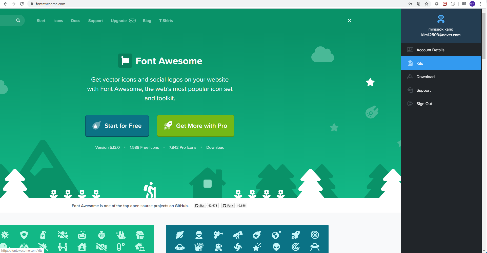
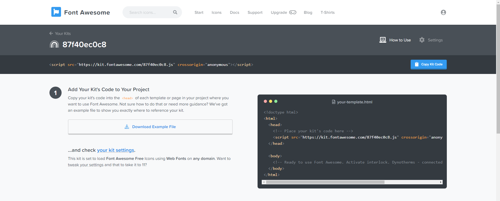

# 1. follow and like

모델 간 M:N 관계를 형성해 인스타그램 등 여러 커뮤니티에서 사용되는 팔로우 및 좋아요를 구현 할 수 있다.


## 1.1 모델 관계

모델의 관계는 `1:N`과 `M:N`으로 나누어 볼 수 있다.


### 1:N

`ForeignKey`를 통해 관계를 연결하며, 담임선생님과 학생들 처럼 1대 다수의 관계를 형성하는 경우이다.

이 경우 teacher에서 student를 참조할 경우 `student_set`을 통해 참조해야한다.

```python
teacher = models.ForeignKey(Student,
                           on_delete=models.CASCADE)
```


### M:N

`ManyToManyField`를 통해 관계를 연결하며, 커뮤니티의 팔로우처럼 서로가 다대다의 관계를 형성하는 경우이다.

이 경우 `followers` 직접 참조 할 수 있으며, `related_name`에 정의한 이름으로 역참조를 할 수 있다. 즉 한 개체에서 자신을 팔로우 한 유저와, 자신이 팔로우 한 유저를 참조 할 수 있다.

```python
followers = models.ManyToManyField(settings.AUTH_USER_MODEL, related_name='followings')
```


## 1.2 follow 구현

follow를 구현 할 때 유의해야 할 점이 있다. User모델이 팔로우에 관련된 속성을 가져야 하므로 모델과 폼을 커스텀 해주어야 한다는 것이다.


- model

```python
# models.py

from django.db import models
from django.conf import settings
from django.contrib.auth.models import AbstractUser

class User(AbstractUser):
    followers = models.ManyToManyField(settings.AUTH_USER_MODEL,
                                        related_name='followings')
```


- form

```python
from django.contrib.auth.forms import UserCreationForm
from django.contrib.auth import get_user_model

class CustomUserCreationForm(UserCreationForm):
    class Meta(UserCreationForm.Meta):
        model = get_user_model()
```

**폼 형성 함수의 이름이 변경되므로, views.py의 UserCreationForm을 커스텀 함수로 변경해주어야한다.**


팔로우 상태에 따라 팔로우 버튼을 토글 해주어야 하고, 동작 또한 변경되어야 하므로 이를 html과 views에서 고려해주어야 한다.

먼저, 팔로우 기능은 다음과 같이 구현한다. 구현 시 `request.user`(팔로워), 팔로우 되는 대상(팔로윙)을 잘 구분해야 한다.

또한 함수 정의 단계에서 본인이 팔로우 할 수 없도록 조건을 추가 해주어야 한다.

```python
# views.py

@login_required
def follow(request, username):
    User = get_user_model()
    user = get_object_or_404(User, username=username)
    if user != request.user:
        if user.followers.filter(pk=request.user.pk).exists():
            user.followers.remove(request.user)
        else:
            user.followers.add(request.user)

    return redirect('accounts:profile', username)
```


함수 정의에서와 마찬가지로 프론트에서도 본인의 경우 팔로우를 할 수 없도록 하고, 팔로우 버튼이 토글 되도록 해야한다.

아래 코드에서의 user는 팔로워, profile_user 팔로윙이다.

```html

    
    <a href="" profile_user.pk %}>언팔로우</a>
    
    <a href="" profile_user.pk %}>팔로우</a>
    

```


## 1.3 fontawesome

[fontawesome](https://fontawesome.com/)은 좋아요와 같은 기능에서 사용하는 다양한 버튼을 오픈소스를 통해 사용할 수 있는 사이트이다.

먼저 폰트 어썸을 사용하기 위해 계정을 만들고 로그인을 한다.  메인화면 우상단의 프로필 버튼을 누르면 네비게이션을 통해 `kits` 메뉴로 이동 할 수 있다.




kits를 선택하면 CDN을 통해 폰트어썸을 사용 할 수 있다.




CDN을 html의 head에 추가하고 나면, 아이콘을 골라 추가하기만 하면 된다.

원하는 아이콘을 검색한 후, `Start Using This Icon`을 누르면 `<i class="fas fa-thumbs-up"></i>`과 같이 코드를 제공 받을 수 있으며 해당 코드를 텍스트 처럼 추가하면 된다.

실제로 아이콘의 경우 텍스트처럼 사용되므로, 부트스트랩, css의 텍스트 제어를 그대로 적용 할 수 있고 `Docs` 메뉴를 보면 아이콘의 크기, 스타일 등을 변경 할 수 있다.

