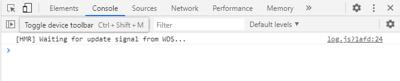
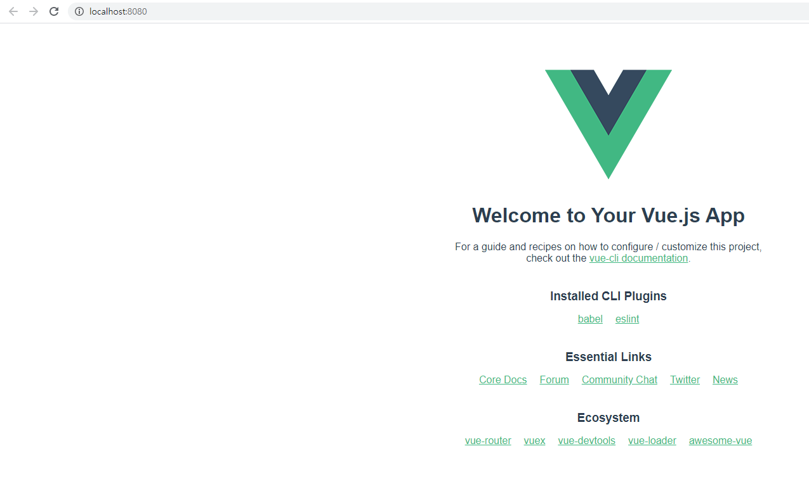
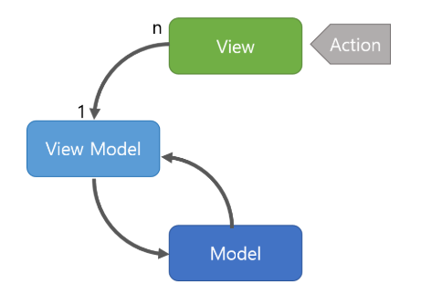

# 1.Vue

`Vue.js`는 웹 개발을 편리하게 하기 위해 개발된 자바스크립트 프론트엔드 프레임워크이다. Vue는 웹 UI 개발의 접근성을 높여주며 특히 SPA(Single Page Application)을 구축하는데 용이하다.


## 1.1 설치
Vue.js를 개발하기 위한 시스템으로 Vue CLI3를 설치한다. CLI는 앱개발에 집중 할 수 있도록 프로젝트의 구성을 도와주는 역할을 하며, 오픈소스 접근성 또한 매우 높고 Git으로 clone을 하지 않아도 `.gitignore`와 함께 프로젝트를 생성 할 수 있도록 도와준다.

Vue CLI를 설치하기 위해서는 먼저 8.9 버전이상의 `Node.js`가 필요하다. Node.js는 [Node 공식 다운로드 페이지](https://nodejs.org/ko/download/)에서 받을 수 있다.

cmd에서 다음과 같은 명령어를 사용해 제대로 설치되었는지를 확인 할 수 있다. 추가적으로 `npm`이 제대로 설치되었는지도 확인한다.

```bash
C:\Users\11>node --version
v12.16.3
C:\Users\11>npm --version
6.14.4
```


npm은 Node Package Manager의 줄임말로 Node기반의 오픈소스를 모듈로 받을 수 있다. 이를 통해서 Vue CLI를 설치한다. npm 명령어에서 i는 install을 의미하고, -g는 global환경을 의미한다.

```bash
$ npm i -g @vue/cli
```


설치절차가 끝난 후, 마찬가지로 제대로 설치되었는지를 확인해준다.

```bash
vue --version
@vue/cli 4.4.1
```


### 1.1.1 Visual code 세팅

- 프로젝트 진행환경인 VS code에서 편리하게 vue를 개발하기 위해 몇가지 Extension을 설치한다.

  - Vetur: 자동완성, 디버깅편의성 등 여러기능을 제공
  - DotENV: 문법 하이라이팅
  - vscode-icons: 직관적인 아이콘

- vue환경의 탭사이즈를 2칸으로 설정한다.

  - `ctrl`+`shift`+`p`로 세팅 검색창을 열고, **Open Settings (JSON)**을 검색

  - 다음과 같이 설정을 추가

    ```json
    "[vue]": {
        "editor.tabSize": 2
    },
    ```


### 1.1.2 개발자 도구 확장 프로그램

[구글 크롬 웹 스토어](https://chrome.google.com/webstore)에서 vue환경을 위한 개발자 도구인 `Vue.js devtools`를 설치해준다.

해당 툴을 설치 한 후, 개발자도구(F12)에서 Memory 옆에 있는 `>>`를 선택하면 Vue를 위한 개발자 도구를 사용 할 수 있다.




## 1.2 프로젝트

vue는 app과 component로 프로젝트가 구성되며 프로젝트를 생성하고나면 기초적인 default 페이지가 제공된다. 

bash환경에서 다음과 같은 명령어를 통해 프로젝트를 생성 할 수 있다.

```bash
$ vue create {프로젝트명}
```


해당 명령어를 사용하면 다음과 같이 구성요소를 선택 할 수 있다. default를 선택하면 `babel`, `eslint`를 설치하게 되고 `Manually select features`를 선택하면 추가적인 요소를 설치 할 수 있다. `방향키`와 `Enter`를 사용하여 선택 할 수 있다.

```bash
Vue CLI v4.4.1
? Please pick a preset: (Use arrow keys)
> default (babel, eslint) 
  Manually select features 
```


설치가 완료되면 프로젝트는 다음과 같이 구성된다. 프로젝트 생성시 기초적인 git요소도 생성되는 것을 볼 수 있다. 또한 `HelloWorld`라는 기본적인 페이지가 생성되어 있다.

```bash
11@DESKTOP-EC868A6 MINGW64 /e/visualcode/live/vue/test (master)
$ ls -a
.   .git        babel.config.js  package.json       public     src
..  .gitignore  node_modules     package-lock.json  README.md
```


서버를 구동해 페이지를 확인해보자. 가장 기초적인 명령어는 `README.md`에 기술되어 있다.

```bash
$ npm run serve
# ... #
  App running at:
  - Local:   http://localhost:8080/
  - Network: http://192.168.0.14:8080/

  Note that the development build is not optimized.
  To create a production build, run npm run build.
```


위의 링크에 접속하면 `HelloWorld` 페이지를 확인 할 수 있다.




기본적으로 `HelloWorld`가 만들어지므로 프로젝트 생성 후 관련된 요소들을 삭제하고, 프로젝트를 진행해야한다. `HelloWorld` 페이지를 보면서 프로젝트가 어떻게 구성되는지 확인해보자.

`public`폴더에는 프로젝트의 기본적인 틀들이 존재한다. 특히 `index.html`은 프로젝트의 가장 기본적인 토대로 CDN을 추가 할 경우 이곳에 추가해주도록 한다.

`src`폴더는 프로젝트를 구성하는 assets(이미지 등), components, view, app으로 구성되어 있다. (router를 사용 할 경우 src에 위치하게 된다) 프로젝트의 ui를 구성하는 핵심 폴더이다. `App.vue`는 vue에서의 프로젝트 구성에서 최상위 단계로 components를 직접 사용하거나 router-link를 위한 nav로 사용 될 수 있다.


## 1.3 vue의 특징

vue는 다음과 같은 특징을 갖는다.


### 1.3.1 MVVM



> 이미지출처: https://beomy.tistory.com/43

- View: 사용자에게 보여지는 UI
- View Model: View를 표현하기 위한 Model
- Model: 앱에서 사용되는 데이터를 처리


### 1.3.2 리액트 + 앵귤러

vue는 리액트의 단방향 데이터 흐름의 장점과 앵귤러의 양방향 데이터 바인딩의 장점을 결합한 프레임워크이다. 

양방향 데이터 바인딩은 View의 데이터값과 Model의 데이터 값이 동기화되어 한쪽이 변경 될 경우 다른 한쪽도 자동으로 변경되는 것을 의미하며, 단방향 데이터 전달의 경우 상위 단계에서 하위 단계로만 전달되는 구조를 의미한다.