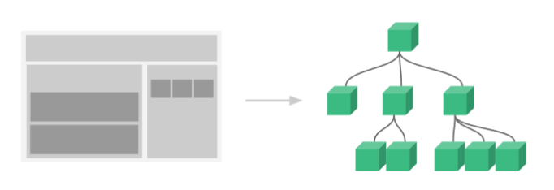
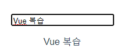
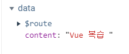

# 1. 바인딩

바인딩이란 데이터와 뷰를 일치시키는 연결방식으로 단방향 바인딩과 양방향 바인딩으로 나누어진다.

양방향 바인딩은 데이터가 변화하면 뷰가 변화하는 단방향 바인딩과 다르게, **데이터와 뷰 양쪽의 변화가 서로 영향**를 줄 수 있도록 데이터 흐름을 만드는 것을 의미한다.

Vue에서는 단방향, 양방향 바인딩을 모두 사용하는데 단방향의 경우 상위 컴포넌트에서 하위 컴포넌트로 데이터를 전달 할 경우 사용하고 양방향의 경우 한 컴포넌트 내에서 사용하도록 한다. 양방향 바인딩을 여러 컴포넌트에 거쳐 사용 할 경우 Vue의 상위 컴포넌트에서 하위 컴포넌트로만 데이터를 변경 할 수 있도록 하는 트리 구조를 해칠 수 있으니 지양하도록 해야한다.


## 1.1 단방향 바인딩



> **Vue의 수직적 트리구조** | 출처: [Vue 공식가이드](https://kr.vuejs.org/v2/guide/index.html)


Vue는 기본적으로 App을 컴포넌트 트리 구조로 구성하기 때문에 컴포넌트 간 데이터 전달은 단방향 바인딩을 사용하고, 사용자가 조작 할 필요가 없는 데이터의 경우 단일 컴포넌트에서도 사용한다. 이 때 `v-bind`라는 디렉티브를 사용하며 접근성을 위해 `:` 약어로 사용 할 수 있다.


### 1.1.1 단일 컴포넌트 내

단일 컴포넌트 내에서 단방향 바인딩은 컴포넌트의 데이터(computed, methods도 가능하다)를 html의 속성으로 사용하기 위해 쓰인다. 예를 들어 url이라는 주소를 담고있는 변수가 있고 이를 `href`속성에 바인드하고 싶다면 다음과 같이 코드를 작성한다. 앞서 언급한 것처럼 접근성을 위해 약어를 사용 할 수 있다.

```vue
<!-- 전체 문법 -->
<a v-bind:href="url"> ... </a>

<!-- 약어 -->
<a :href="url"> ... </a>
```


### 1.1.2 상위 -> 하위 (컴포넌트)

상하위 간 바인딩 역시 v-bind를 사용한다. 이 때 상위 컴포넌트로 부터 데이터를 전달받는 하위 컴포넌트는 props 옵션을 사용해 명시적으로 수신 할 데이터를 선언해야한다. `Parent`라는 상위 컴포넌트가 `Child`라는 하위 컴포넌트에게 `pData`라는 변수를 전달한다고 가정하자. 

```vue
// Parent.vue

<template>
  <div>
    <Child :cData="pData"/>
  </div>
</template>
```


위와 같이 바인딩을 하게 되면 Parent의 pData를 Child에서는 cData의 이름으로 받게 된다. (구분을 위해 다르게 이름을 지었을 뿐 대부분 같은 이름으로 작성한다)

데이터를 수신하는 Child는 어떤 데이터를 받게 되는지를 명시적으로 선언한다. 받게되는 데이터의 타입이나 데이터의 유무에 따라 유효성 검사를 하게되며 충족이 되지 않는 경우 Vue에서 경고를 보낸다.

```vue
// Child.vue

<script>
export default {
  name: 'Child',
  props: {
    cData: {
      type: {변수타입},
      requird: true,
    },
  },
}
</script>
```


type만을 기술하는 경우 다음과 같이 간단하게 작성 할 수 있다.

```vue
// Child.vue

<script>
export default {
  name: 'Child',
  props: {
    cData: {변수타입},
  },
}
</script>
```


## 1.2 양방향 바인딩

양방향 바인딩은 사용자의 조작에 따라 반응하는 웹페이지를 쉽게 구현 할 수 있게 해준다. 양방향 바인딩은 주고 받는 쪽이 모두 변화를 일으키기 때문에 **상위->하위 컴포넌트 간에서는 사용해서는 안되며**, 단일 컴포넌트 내에서 필요시에만 사용하도록 한다.

실제로 양방향 바인딩이 어떻게 작동되는지 알아보자. 먼저 `input`을 만들고 input의 내용을 가질 변수 `content`를 선언하도록 한다. 우리는 `v-model`이라는 디렉티브를 사용해 input의 내용과 content라는 변수를 양방향 바인딩 시킬 수 있다. 실제 값이 어떻게 변하는지를 알기 위해 input 아래에 content를 작성하자.

```vue
<input type="text" v-model="content">
{{ content }}
```


input에 내용을 작성하면 그에 대응되어 변경되는 content의 값을 확인 할 수 있다.



> **양방향 바인딩으로 인해 변경되는 변수의 값**