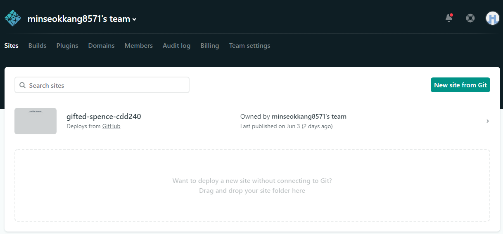
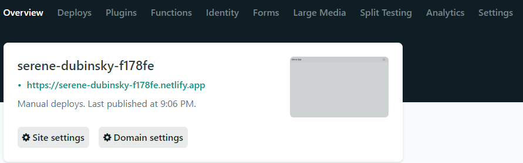

# 1. 프로젝트 배포하기

`netlify`를 이용하여 Vue 프로젝트를 손쉽게 배포 할 수 있다. netlify의 로그인은 git아이디를 이용해 할 수 있으며, 배포 방식 또한 프로젝트 폴더를 직접 업로드하는 방법과 git 저장소를 사용하는 방법이 있다. 해당 문서에서는 두가지 프로젝트 배포 방법에 대해 기술한다.

먼저 [netlify 공식 홈페이지](https://www.netlify.com/)에 접속하고 로그인을 하도록 한다.


## 1.1 폴더를 직접 업로드

- 프로젝트 폴더를 직접 배포하기위해 다음 명령어를 통해  `dist`폴더를 생성한다.

```bash
$ npm run build

# ... #

$ ls
babel.config.js  node_modules/  package-lock.json  README.md    src/
dist/            package.json   public/            sample.json
```


- 생성된 dist폴더를 아래 이미지의 점선박스에 드래그 앤 드랍한다. 이에 따라 Deploy가 자동으로 진행된다.



> **netlify의 Sites 페이지**


- Sites > {해당 사이트} > Overview의 도메인을 통해 사이트를 이용 할 수 있다. 만약 도메인을 소지하고 있다면 해당 도메인을 변경 할 수 있으며 추가적으로 HTTPS를 사용 할 수도 있다.



> **netlify의 사이트 Overview**


## 1.2 Git 저장소를 이용

- 1.1의 Sites 페이지에서 `New site from Git` 버튼을 클릭한다.
- 어떤 Git provider(GitHub, GitLab, Bitbucket)를 사용 할 지 선택한다.
- 배포할 저장소를 선택한다.
- `Build command`에 **npm run build**를, `Publish directory`에 **dist**를 작성한다.
  - 프로젝트에서 `.env.local`등을 이용하여 변수를 저장 할 경우 `Show advanced`를 두번 클릭하고 키값을 등록하여 준다.
- 아래 이미지와 같이 작성을 완료 한 후 Deploy site를 클릭한다


> **Git 저장소환경에서 Deploy를 위한 세팅**


위와 같이 세팅을 마친 뒤 도메인을 통해 사이트를 이용 할 수 있다. Git 저장소를 이용하면 netlify에서 저장소를 지속적으로 확인하고 버전을 알아서 갱신 해주기 때문에 직접 dist를 업로드하는 것에 비해 프로젝트 버전 변경에 유리하다.