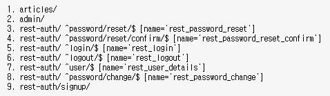
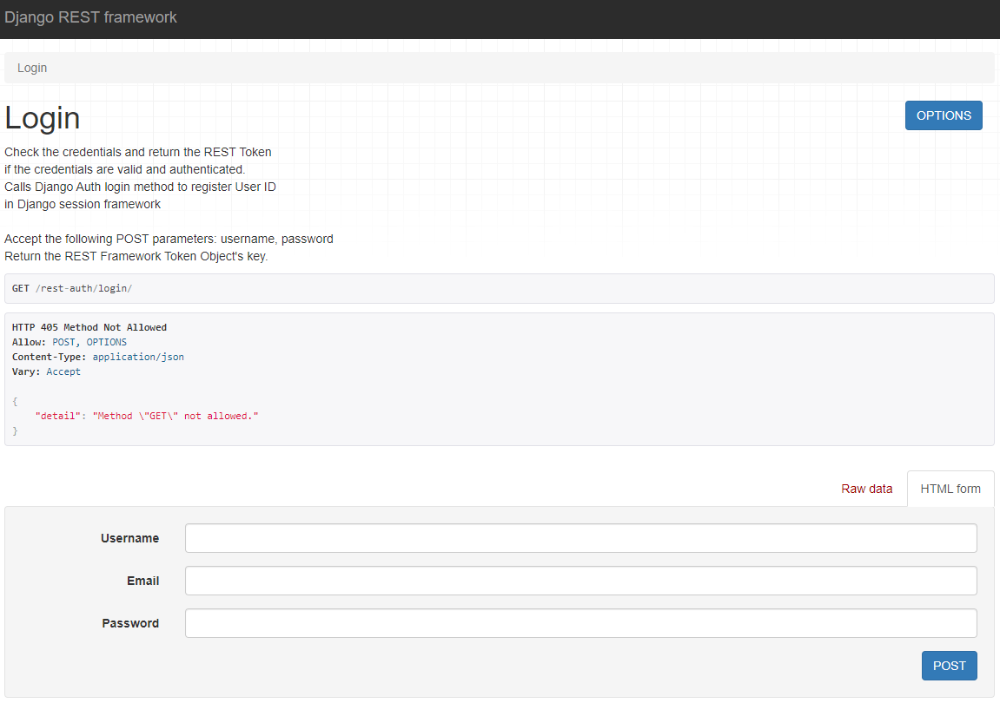

# 1. django api server

기존의 rest_framework와 serializer를 사용한 서버에 추가적인 api를 사용해 로그인, 로그아웃, 회원가입을 할 수 있는 DRF 서버를 구축해보자.

> 참고문서: [django-rest-auth 문서](https://django-rest-auth.readthedocs.io/en/latest/installation.html), [DRF api가이드](https://www.django-rest-framework.org/api-guide/authentication/)


## 1.1 모듈 설치 및 세팅

로그인, 로그아웃, 회원가입을 위한 복잡한 과정을 손쉽게 해결하고 페이지를 제공하는 두가지 모듈을 설치한다. `django-rest-auth`는 로그인, 로그아웃 기능을 제공하며, 회원가입 기능을 위해서는 `django-allauth`를 추가적으로 설치해야 한다.

```bash
$ pip install django-rest-auth django-allauth
```


### settings.py

설치를 마친후, `settings.py`에서 몇가지 세팅을 해야한다. 먼저 `INSTALLED_APPS`에 모듈에 관련된 APP들을 추가하고 `SITE_ID = 1`을 파일의 최하단에 추가한다.

```python
INSTALLED_APPS = [
    # ... #
    'django.contrib.sites',
    'rest_framework',
    'rest_framework.authtoken',
    'rest_auth',
    'allauth',
    'allauth.account',
    'rest_auth.registration',
]
# ... #
SITE_ID = 1
```


우리는 인증방식으로 토큰을 사용하기 때문에 globally로 되어있는 세팅값을 변경해주어야 한다. 참고문서2의 authentication 세팅을 복사 한 후 Basic을 token으로 변경한 뒤 홀로 남겨준다.

```python
REST_FRAMEWORK = {
    'DEFAULT_AUTHENTICATION_CLASSES': [
        'rest_framework.authentication.TokenAuthentication',
    ]
}
```


### urls.py

참고문서1에 있는 url들을 추가한다. 우리는 path를 사용하므로 이에 맞게 변경한다. (추가적으로 회원가입 url을 signup으로 변경)

```python
urlpatterns = [
    # ... #
    path('rest-auth/', include('rest_auth.urls')),
    path('rest-auth/signup/', include('rest_auth.registration.urls')),
]
```


### SQLite EXTENSION

VS code에서 DB를 시각적으로 볼 수 있는 `SQLite EXTENSION`를 설치한다. `ctrl`+`shift`+`p`를 누르면 나오는 세팅에서 **SQLite: Open Database**를 선택하고 **db.sqlite3**를 선택한다. 이후, `EXPLORER`를 확인하면 `SQLITE EXPLORER`가 추가 된 것을 확인 할 수 있으며 이를 통해 db.sqlite3를 시각적으로 볼 수 있다.


## 1.2 서버 동작

위의 세팅을 마치고 나면 서버는 다음과 같은 url을 갖게 된다.



> **api 서버의 url**


또한 각각의 rest-auth url들은 DRF를 통해 page를 제공받는다.



> **api 서버의 Login 페이지**


