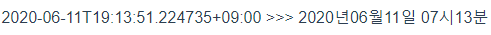

# 1. string to Date

`moment`라는 모듈을 사용해 string형태의 데이터를 원하는 Date형식으로 가공 할 수 있다. moment모듈은 `Moment.js`라는 시간 데이터 조작을 위한 라이브러리를 Vue에서 사용 할 수 있게 해준다.


## 1.1 필터

이 때 조작을 위해 Vue에서 텍스트 형식화를 위해 지원하는 필터인 `Vue.filter`를 사용한다. 필터는 중괄호 보간법 이나 `v-bind`표현법을 사용 할 때 사용 할 수 있다.

예를 들어 다음과 같이 필터를 사용하면 **message**라는 데이터의 앞부분을 대문자로 치환 할 수 있다.

```html
{{ message|capitalize }} 
<!-- min -> Min -->
```


이렇게 필터를 사용하기 위해서는 로컬 혹은 전역으로 필터를 정의해주어야 한다. 해당 문서에서는 `main.js`에 전역으로 정의하는 방식을 선택하였다. 위의 **capitalize**필터는 다음과 같이 정의된다.

```js
Vue.filter('capitalize', function (value) {
  if (!value) return ''
  value = value.toString()
  return value.charAt(0).toUpperCase() + value.slice(1)
})
```


## 1.2 moment

1.1의 필터와 moment모듈을 이용해 string의 다양한 시간 데이터를 원하는 형식으로 변경 할 수 있다. 먼저 이를 위해 moment 모듈을 설치한다.

```bash
$ npm install moment
```


후에 moment를 이용해 데이터형식을 작성한다.

```js
import moment from 'moment'
# ... #
Vue.filter('formatDate', function(value) {
  if (value) {
    return moment(String(value)).format('YYYY년MM월DD일 hh시mm분')
  }
})
```


이후 원하는 데이터에 필터를 적용해준다.

```js
<p>{{ date|formatDate }}</p>
```


위의 절차를 통해 다음과 같이 UNIX형식 데이터를 원하는 형식으로 변경 할 수 있다.



> **moment를 사용한 데이터 조작의 예**

