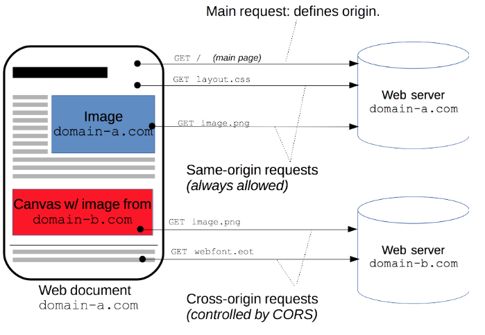
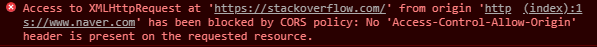

# 1. CORS

`CORS`(Cross-Origin Resource Sharing)는 웹 프로그래밍을 하다보면 꼭 만나게 될 에러이다. 직역을 하면 교차 출처 리소스 공유인데, 다른 출처를 가지고 자원 공유를 시도 했다는 의미이다. 해당 문서에서는 왜 CORS 에러가 발생하는 지 장고환경에서 어떻게 처리 할 지에 대해 기술한다.


## 1.1 왜 발생하는가?

사실 CORS가 발생하는 것은 굉장히 자연스러운 일이다. 그렇다면 왜 장고만을 사용한 템플릿 구조에서는 발생하지 않았을까??

답은 CORS의 이름에 있다. CORS는 서로 다른 호스트 (ip와 port)를 가진 출처가 request, response 동작을 하는 경우 발생하기때문이다. 실제로 장고만을 사용 할 경우, 사용자는 같은 도메인에서 request를 보내게 된다.

아래 그림은 도메인이 같은 경우의 request와 다른 경우의 request (CORS발생)의 예를 잘 보여준다. 그림에서의 domain-a는 장고만을 사용하는 경우, domain-b <-> domain-a의 관계는 서버와 클라이언트의 도메인 다른 경우로 볼 수 있다.



> **도메인의 동일 유무에 따른 response** | 출처: [MDN wed docs](https://developer.mozilla.org/ko/docs/Web/HTTP/CORS)


위의 예시를 보면 CORS가 발생하는 것은 매우 당연하다. 서버는 자원을 가지고 있고 선별된 대상에게 자원을 제공 할 필요가 있기 때문이다. 만약 CORS정책이 없다면 우리는 네이버 페이지에서 스택오버플로우에 request를 보내 response를 받을 수도 있을 것이다. 한번 도전해보자.

```js
var xhr = new XMLHttpRequest();
xhr.open('GET', 'https://stackoverflow.com/');
xhr.send();
```


 

> **naver와 stackoverflow간 CORS**


만약 이 시도가 성공적이라면 우리는 브라우저에 `https://stackoverflow.com/`의 response가 뿌려지는 것을 볼 수 있었을 것이다. 이는 아무리 생각해도 이상한 일이다.


## 1.2 어떻게 해결하는가?

CORS 정책을 작동시키기 위해 client의 request헤더에는 요청을 보내는 주소인 `Origin`이 존재한다. 서버는 request 패킷을 받으면 헤더를 확인하고 `Access-Control-Allow-Origin`를 헤더에 담아서 응답한다.

즉, Access-Control-Allow-Origin에 Origin의 주소가 포함되어 있다면 **정상적으로 페이지를 표현** 할 수 있다는 것이다. (CORS가 발생하더라도 응답코드는 200이다) 우리는 여기서 두가지를 고려해야한다.

1. 어떻게 Access-Control-Allow-Origin에 호스트를 등록하는가?
2. CORS 정책에 걸려도 왜 응답 상태가 200 인가? (1.3에서 다룸)


### django에서 CORS헤더 사용하는 법

장고에서는 CORS를 해결하기 위한 모듈을 제공한다. 아래 명령을 통해 모듈을 설치하자.

> 참고문서: [pypi 프로젝트 문서](https://pypi.org/project/django-cors-headers/)

```bash
$ pip install django-cors-headers
```


설치가 끝나면 `settings.py`에 앱을 등록해주고 `MIDDLEWARE`에도 다음과 같이 값을 추가해준다. 해당 프로젝트의 참고문서에는 `CorsMiddleware`를 **최대한 높은 위치에 작성**해달라고 기술되어있다.

```python
# settings.py

INSTALLED_APPS = [
     ... 
    'corsheaders',
     ... 
]

MIDDLEWARE = [ 
     ... 
    'corsheaders.middleware.CorsMiddleware',
     ... 
]
```


이후 헤더에 추가 할 주소를 등록해준다. `CORS_ORIGIN_ALLOW_ALL`을 True로 설정해 모든 호스트를 허용하거나 특정 리스트를 사용해 등록 할 수 있다.

```python
# settings.py

CORS_ORIGIN_ALLOW_ALL = True
# or
CORS_ORIGIN_WHITELIST = [
  "허용 할 도메인",
]
```


## 1.3 CORS의 주체

오직 서버와 클라이언트의 관점에서 생각하다보면 여러 이상한 점들이 있다.

1. CORS정책에 걸려도 서버는 200의 응답상태를 가진다. (response 개체의 status는 0)
2. 서버 프레임워크에서 API로 요청을 해도 CORS에 걸리지 않는다.


1번의 경우, 서버에서는 잘못된 요청이라는 것을 알릴 의무가 있기 때문에 패킷을 보내는 것 자체는 문제가 되지 않는다. 하지만 200을 응답한다는 것은 조금 이상하다. 명백하게 에러가 나는 상황이기 때문이다.

2번의 경우, 문서의 앞부분에서 설명했듯이 서로 다른 호스트 (서버 <-> API서버) 간 통신이므로 CORS가 발생해야 할 것이다.


위의 두가지 의문의 답은 바로 **CORS의 주체는 브라우저**라는 것이다. 실제로 서버는 CORS정책에 있어 Access-Control-Allow-Origin를 보유하고 브라우저에 제공할 뿐 다른 역할을 하지 않는다. 즉, 서버로서의 통신은 문제가 없다.

2번의 경우도 브라우저를 통하지 않는 서버 프레임워크에서 보낸 요청은 문제가 되지 않으며 CORS 정책을 사용하는 네이버 API와 같은 경우에도 django와 같은 서버 프레임워크에서의 요청은 문제가 되지 않는다.


