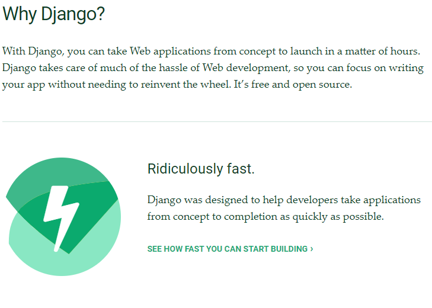
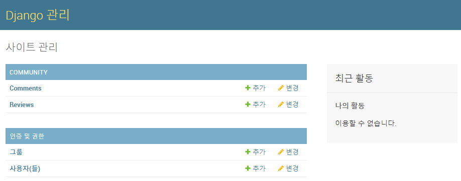
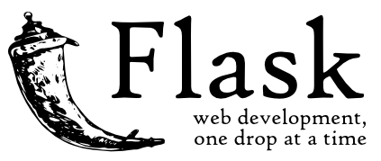
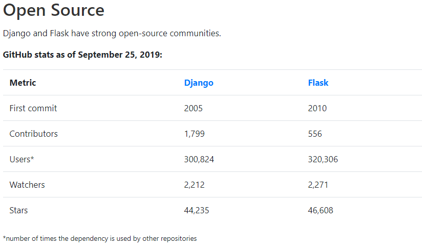

# 1. Django vs Flask

장고와 플라스크는 가장 많이 사용되는 파이썬기반 웹 프레임워크이다. 장고와 플라스크가 각각 어떤 특징을 가지고 있는지 어디서 쓰이고 있는지 등에 대해 알아보도록 하자.

## 1.1 Django

> **Why Django?** | 출처: [장고 공식홈페이지](https://www.djangoproject.com/start/overview/)

장고는 파이썬기반 웹 프레임워크중에 가장 높은 점유율을 가지고 있는 프레임워크이다. 장고의 주된 목표는 **'웹사이트를 작성하는 데 있어서 수고를 더는 것**'으로 빠른 개발속도를 강조하고있다. 그렇다면 장고는 어떤 특징을 가지고 있을까?

### 기본적으로 제공되는 강력한 기능들

> **장고의 관리자 페이지**

장고는 기본적으로 개발자를 위한 관리자 페이지를 제공한다. 관리자 페이지를 이용해 정의된 model들을 생성, 삭제, 수정할 수 있으며 이런 환경을 위한 작업은 정말 간단하다.

이외에도 sqlite, 사용자 인증 및 권한 관리, 폼 검증 등 다양한 기능들을 기본적으로 제공한다. 실제로 개발자가 세팅하고 개발하기 힘들고 불편한 부분들을 제공하는 것이다. 이는 앞서 언급된 빠른 개발속도를 위한 장고 개발자들의 철학이 보이는 부분이다.

### Django ORM

장고는 데이터베이스와 파이썬 객체를 매핑(mapping)시켜 개발환경에서 편리하게 조작할 수 있는 ORM(Object-relational mapping)을 제공한다. ORM을 사용하면 데이터의 재사용이 편리해지고 직관성에서 이점을 가질 수 있다. 

## 1.2 Flask

> **플라스크 로고** | 출처: [플라스크 공식홈페이지](https://flask.palletsprojects.com/en/1.1.x/)

플라스크는 장고보다 **가볍고 자유로운 환경에서의 개발**을 강조한다. 어떤면에서 플라스크가 강점을 가지는지 알아보자.

### 가벼운 웹 프레임워크

플라스크는 Template, Cookie, URL routing 등 기본적인 기능을 제공한다. 때문에 장고에 비해 1/10도 안되는 코드로 구현되어있고, 기본적으로 바닥에서 개발을 시작할 수 있기 때문에 개발자의 목적에 맞게 여러 모듈을 붙여 개발을 할 수 있다. 즉, 장고의 경우 A방식만을 고집하여 어떤 기능을 구현한다면 플라스크는 여러 방식 중에서 **개발환경과 목적에 맞는 모듈을 선택하여 구현**을 할 수 있다. 이는 결과물이 복잡해질수록 강한 이점이된다.

## 1.3 결론

장고는 sqlite와 ORM을 이용하는 것이 기본이지만, 플라스크에서는 어떤 데이터베이스를 사용하던 개발자의 마음이고 장고에서 기본적으로 제공되는 form, admin 같은 것들도 모두 모듈로서 사용을 해야한다. 이 부분이 장고와 플라스크의 가장 큰 차이점인데 장고 대비 플라스크의 장점은 가벼움과 자유로움, 두가지가 모두라고 볼 수 있다. 이는 능숙하지 못한 개발자에게는 개발에 사용해야 할 많은 서드파티 모듈을 검토하고 설치하는 높은 장벽이 될 수도 있고, 자신의 개발결과물을 목적에 맞게 개발할 수 있는 자유도가 될 수도 있으므로 무엇이 더 좋다라고 말할 수는 없을 것 같다.

실제로 게시판과 같은 많은 기능이 필요한 웹 사이트의 경우 장고가 개발 편리성과 생산성에서 이점이 있을 것이고, 간단한 REST API기반 웹이라면 플라스크가 더 좋은 선택지가 될 수 있다.

> **장고와 플라스크의 오픈소스 통계** | 출처: https://testdriven.io/blog/django-vs-flask/#security%20](https://testdriven.io/blog/django-vs-flask/#security

2019년 깃허브 오픈소스 통계를 보면 장고가 더 많은 기여자들을 가지고 있고, 플라스크를 사용하는 프로젝트가 더 많은 것을 볼 수 있다. 마이크로서비스에 대한 관심이 높아짐에 따라 플라스크에 대한 관심이 증가하는 반면, 기존의 개발자들은 장고를 사용하기 때문에 이런 경향이 보이는 것 같다.