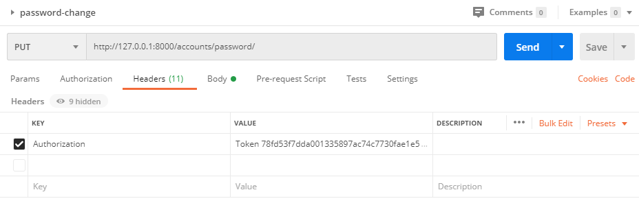
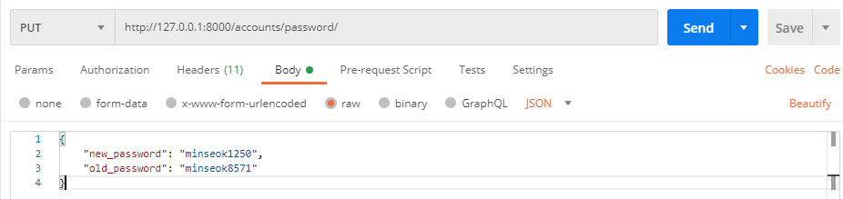
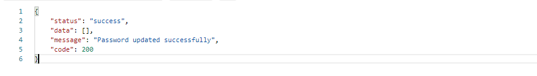
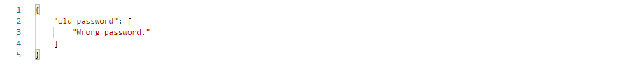

# 1. DRF password API

DRF(Django Rest Framework)를 기반으로한 프로젝트에서 password변경을 제공하는 API endpoints를 만들어보자.


## 1.1 구현

`serializers.py`, `views.py`등에 코드를 작성하므로 `accounts`등의 app을 만들어 진행하도록 하자.

- `serializers.py`에 다음과 같은 코드를 추가하자.

```python
from rest_framework import serializers
from django.contrib.auth.models import User

class ChangePasswordSerializer(serializers.Serializer):
    model = User

    """
    Serializer for password change endpoint.
    """
    old_password = serializers.CharField(required=True)
    new_password = serializers.CharField(required=True)
```

- `views.py`에서 다음과 같은 코드를 추가하자.

```python
from rest_framework import status
from rest_framework import generics
from rest_framework.response import Response
from django.contrib.auth.models import User
from .serializers import ChangePasswordSerializer
from rest_framework.permissions import IsAuthenticated   

class ChangePasswordView(generics.UpdateAPIView):
    """
    An endpoint for changing password.
    """
    serializer_class = ChangePasswordSerializer
    model = User
    permission_classes = (IsAuthenticated,)

    def get_object(self, queryset=None):
        obj = self.request.user
        return obj

    def update(self, request, *args, **kwargs):
        self.object = self.get_object()
        serializer = self.get_serializer(data=request.data)

        if serializer.is_valid():
            # Check old password
            if not self.object.check_password(serializer.data.get("old_password")):
                return Response({"old_password": ["Wrong password."]}, status=status.HTTP_400_BAD_REQUEST)
            # set_password also hashes the password that the user will get
            self.object.set_password(serializer.data.get("new_password"))
            self.object.save()
            response = {
                'status': 'success',
                'code': status.HTTP_200_OK,
                'message': 'Password updated successfully',
                'data': []
            }

            return Response(response)

        return Response(serializer.errors, status=status.HTTP_400_BAD_REQUEST)
```

- 다음으로 `urls.py`에 다음과 같은 코드를 추가하자.

> 보통 `from . import views`의 형태로 import를 하게되는데, 꼭 `from .views import ChangePasswordView`보다 아래에 작성을 하도록 한다.

```python
from .views import ChangePasswordView
from django.urls import path

urlpatterns = [
    # url은 마음대로 변경해도 괜찮다
    path('password/', ChangePasswordView.as_view(), name='change-password'),
]
```


## 1.2 동작확인

해당 API는 `new_password`와 `old_password`를 필수인자로 요구하고, 메서드는 `PUT`만을 허용한다.또한 유저정보를 바꾸는 API이므로 Authorization Token이 필요하다.

동작의 확인을 위해 Postman을 사용해보자.

먼저 로그인을 한 후 발급받은 토큰을 `Headers`에 추가한다.



> **Authorization 추가**


필수인자인 `new_password`와 `old_password`를 넣는다. `Postman`에서는 **마지막에 `,`(trailing comma)를 붙이지 않는 것에 주의하자.**



> **요청에 쓰이는 JSON BODY**


성공적으로 패스워드가 변경되는 경우, 200의 값을 가지는 `code`가 응답된다.



> **성공적인 요청으로 인한 응답**


기존의 패스워드를 잘못 작성한 경우, 다음과 같은 응답을 받게 된다.



> **잘못된 요청으로 인한 응답**

