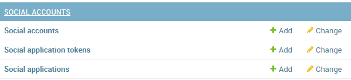
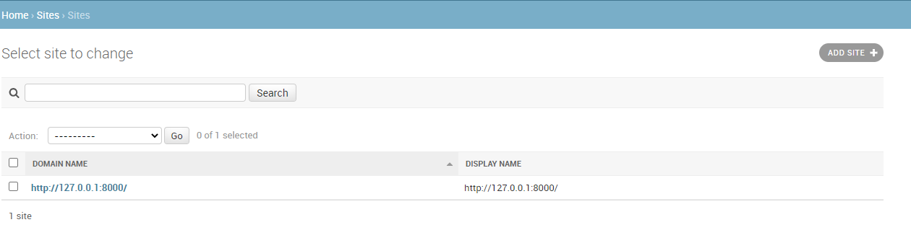
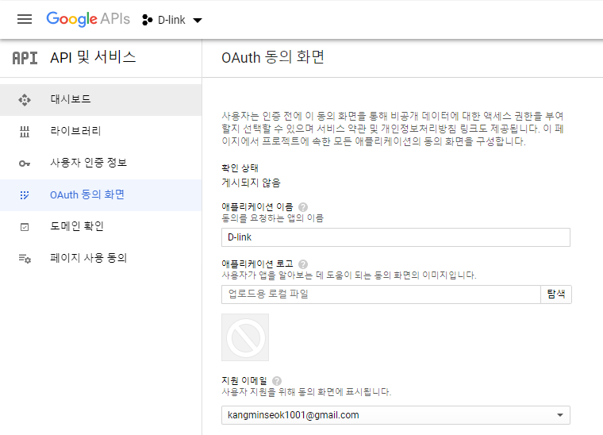
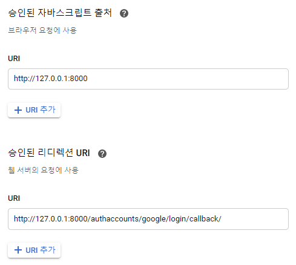
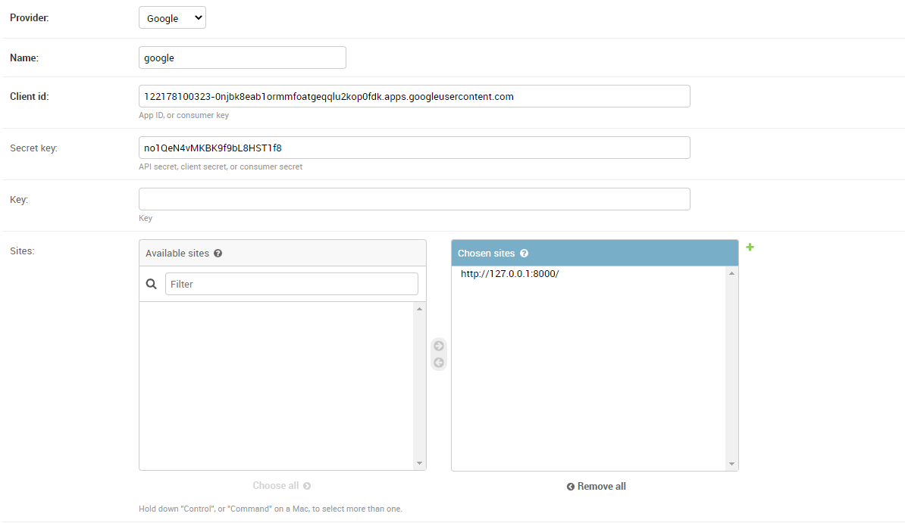
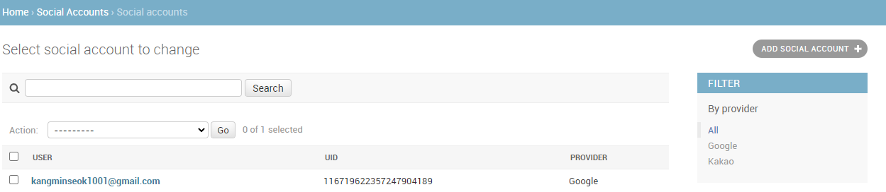

# 1. 소셜로그인

요즘은 사이트에 가입을 하다보면 사이트 고유의 회원가입대신 기존의 카카오톡, 페이스북, 구글과 같은 계정을 통해 회원가입 절차를 간소화하고 추후에도 소셜 계정을 사용해서 로그인하는 서비스가 많이 보인다.

Django에서는 `allauth`를 통해 간단히 소셜로그인을 구현할 수 있으며, `allauth`를 통해 구현할 수 없는 경우 해당 API의 절차에 따라 구현해주어야한다.

소셜로그인 구현의 핵심은 소셜 계정으로부터 회원정보를 가져오고, 이를 우리의 회원DB와 비교하여 회원가입과 로그인을 지원하는 것이다. 이를 위해서 제 1의 목표는 **회원의 정보를 카카오톡, 구글 등으로부터 가져오는 것**이라고 할 수 있겠다.

그럼 카카오톡과 구글의 API를 이용해 로그인을 진행해보자.


## 1.1 공통 세팅

실제로 소셜 로그인은 구글, 카카오톡 외에도 스팀 같은 사이트를 통해서도 가능하다. 먼저 이를 가능하게 해주는 모듈을 설치하자.

```bash
$ pip install django-allauth
```


모듈을 설치하고 나면 `INSTALLED_APPS`에 등록해주어야 하는데, 이 때 원하는 소셜 사이트를 `provider`로 추가해주어야 한다. 우리는 카카오톡과 구글로그인을 구현할 예정이므로 두개만 추가해주면 된다.

```python
# settings.py

INSTALLED_APPS = [
    ...
    'allauth',
    'allauth.account',
    'allauth.socialaccount',
    
    # provider
    'allauth.socialaccount.providers.google',
    'allauth.socialaccount.providers.kakao',
```


그리고 `settings.py`의 밑부분에 다음과 같이 코드를 추가해주자.

```python
# settings.py

AUTHENTICATION_BACKENDS = (
    'django.contrib.auth.backends.ModelBackend', 
    'allauth.account.auth_backends.AuthenticationBackend', 
)

SITE_ID = 1
```


초기에 설치했던 앱은 자체 경로가 존재하는데, 이를 사용하면 더욱 편리하게 소셜 로그인을 할 수 있으므로 경로를 추가해주자. 이 때 url명은 본인의 마음대로 정하면 된다.

```python
# urls.py

from django.contrib import admin
from django.urls import path, include
from django.views.generic import TemplateView

urlpatterns = [
    path('admin/', admin.site.urls),
    path('authaccounts/', include('allauth.urls')), # 추가된 코드
]
```


이 후 `migrate`를 진행해주자.

```bash
$ python manage.py migrate
```


런서버를 한 후 관리자페이지에 들어가면 다음과 같이 소셜에 대한 항목이 생긴 것을 확인 할 수 있다. 해당 테이블은 앞서 등록한 앱에서 제공한다.



> **소셜로그인을 위한 DB테이블**


 `SITE`를 클릭하고, example.com과 같이 되어 있던 도메인을 다음과 같이 변경해주자.



> **SITE 도메인 변경**


도메인 변경이 끝나면, 공통설정이 끝난다!

이제 각각의 소셜 API에 등록을하고 API에 필요한 키값을 얻어와야한다.


## 1.2 구글

구글 API를 등록하기위해 [구글 API 콘솔](https://console.developers.google.com/)에 접속하자.

우리가 가장 먼저 해야하는 것은 프로젝트를 생성하는 것이다. Google API의 로고 옆에있는 버튼을 눌러 프로젝트를 생성하자. 현재 필자는 D-link라는 이름의 프로젝트가 있으므로 다음과 같이 나온다.


> **프로젝트 관리 버튼**


프로젝트 생성이 끝나면 `OAuth 동의 화면`을 설정해야 한다. 여기서는 특별한 것 없이 앱 이름을 추가해주자.



> **OAuth 동의 화면 설정**


이제 `사용자 인증 정보`를 설정해야하는데 이부분이 중요하다. 해당 설정을 통해 클라이언트ID와 보안비밀을 제공받을 수 있고, 우리가 사용할 URI, 리다이렉션 URI를 설정할 수 있기 때문이다. 해당 탭을 클릭하면 먼저 앱 유형과 이름을 물어보는 폼이 제공되는데 이를 적고 나면 중요한 부분이 남는다.

여기서 URI는 서버의 BaseUrl을 작성하면되고, 승인된 리디렉션 URI는 다음과 같이 callback의 형식으로 작성해준다. 리디렉션 URI는 우리가 API로 최초 요청을 보내고 응답을 받은 후에 토큰 발급, 유저정보 얻기 등에 사용되는 callback 함수를 호출하기 위한 url이다.



> **URI설정**


여기까지 진행하면 구글 API로부터 클라이언트 ID와 보안비밀을 제공받을 수 있다. 이제 이 정보들을 관리자페이지에서 등록하는 일만 남았다. 관리자페이지의 `social applications`에서 구글을 등록해주자. 해당 설정에는 `Client id`와 `Secret Key`가 필요한데 구글 API에선 각각 클라이언트 ID와 보안비밀을 의미한다.



> **API등록**


이제 앞서 `urls.py`에 등록했던 경로를 기반으로 `http://127.0.0.1:8000/authaccounts/google/login`과 같이 요청을 보내면 구글 로그인을 할 수 있게 된다. 

성공적으로 로그인을 하게되면 관리자페이지에 다음과 같이 유저가 등록된다.



> **등록된 소셜 유저**