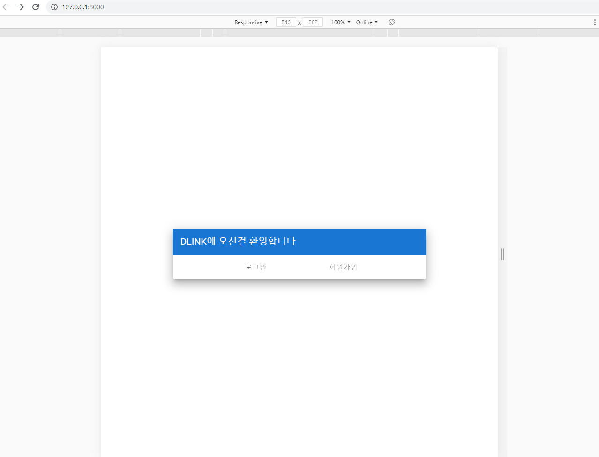
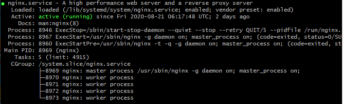
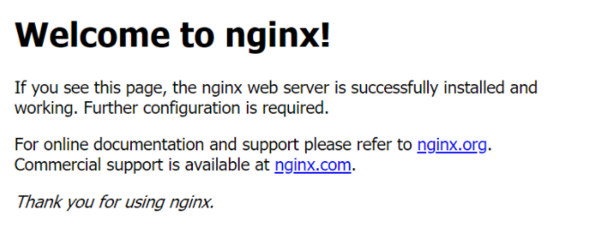

# 1. Channels 서버배포

Django channels를 이용해 HTTP와 WS통신을 모두 사용하는 경우 아래 그림과 같이 ASGI를 처리해 줄 서버가 필요하다. 해당 글에서는 Nginx, Daphne, Gunicorn, EC2를 사용하여 서버를 배포하도록 하겠다.


> Daphne로 돌아가는 구조 | 출처: https://victorydntmd.tistory.com/265


## 1.1 Channels 관련 모듈 설치

Channels와 Daphne의 경우 버전 호환성 이슈가 있는데, 다음과 같이 설치하면 이슈를 임시적으로 벗어 날 수 있다.

```bash
$ pip install channels daphne==2.2.5 asgiref=3.2.10
```


## 1.2 로컬 설정 및 동작확인

서버에 배포하기 전에 먼저 로컬에서 daphne서버로 백엔드를 돌려보자. Django를 설치하고 설정폴더를 보면 `wsgi.py`라는 파일이 있는데, 추가로 `asgi.py`를 만들어주어야 한다.

```python
# asgi.py

"""
ASGI entrypoint. Configures Django and then runs the application
defined in the ASGI_APPLICATION setting.
"""

import os
import django
from channels.routing import get_default_application

os.environ.setdefault("DJANGO_SETTINGS_MODULE", "{프로젝트이름}.settings")
django.setup()
application = get_default_application()
```


추가로 routing application으로 등록해주자. 여기서 `설정폴더이름`은 `asgi.py`를 포함하고 있는 디렉토리를 의미한다.

```python
# routing.py

ASGI_APPLICATION = "{설정폴더이름}.routing.application"
```


이제 daphne를 이용해서 서버를 구동해보자. 

```bash
$ daphne -p 8000 {설정폴더이름}.asgi:application

2020-08-09 13:06:53,049 INFO     Starting server at tcp:port=8000:interface=127.0.0.1
2020-08-09 13:06:53,049 INFO     HTTP/2 support not enabled (install the http2 and tls Twisted extras)
2020-08-09 13:06:53,050 INFO     Configuring endpoint tcp:port=8000:interface=127.0.0.1
2020-08-09 13:06:53,051 INFO     Listening on TCP address 127.0.0.1:8000
```


## 1.3 서버배포

Daphne에 정적파일 issue가 있는 관계로, 먼저 nginx와 gunicorn을 사용해 HTTP통신을 위한 배포를 진행하고, 리버스 프록시로 Daphne를 사용하도록 할 계획이다.

서버배포를 위해 github 혹은 gitlab에 Django프로젝트와 프론트엔드 빌드파일(dist)을 올리고 서버에서 clone하여 사용하도록 하자.


### 1.3.1 Django Vue 통합

> 이렇게 하면 새로고침 누르면 문제가 생긴다 ㅠㅠ 왠만하면 url을 구분해서 프록시로 나누자

필자는 `api/`와 같이 api url을 구분 하지 않는 경우, nginx에서 프록시 경로를 구분하는데 어려움이 있을 수 있다. 이를 해결하기위해 백엔드서버만 구동하면 앱을 사용할 수 있는 환경을 만들어주자. 이처럼 프론트서버를 배제하면 nginx설정이 간편해진다(물론 `api/`로 url을 구분한다면 이렇게 할 필요는 없다).

백엔드 서버만으로 앱을 돌리기위해서는 `yarn build`의 결과물인 `dist`폴더가 필요하다. `dist`폴더의 구조를 깔끔하게 하기 위해 다음과 같이 설정해주자. 아래와 같이 설정하면 css, img, js의 폴더가 static폴더안에 들어가게 된다.

```js
// vue.config.js
module.exports = {

  ...
    
  outputDir: './dist/',
  assetsDir: 'static',
};


```


설정 후 `dist`폴더를 생성해주자.

```bash
$ yarn build
```


Django에서 `index.html`을 Vue의 것을 쓸 수 있도록 설정하자.

```python
# settings.py

...

FRONTEND_DIR = os.path.join(BASE_DIR, '../frontend') # 프론트엔드 폴더 경로에 맞게 변경

STATICFILES_DIRS = [
    os.path.join(FRONTEND_DIR, 'dist/static'),
]

TEMPLATES = [
    {
        'BACKEND': 'django.template.backends.django.DjangoTemplates',
        'DIRS': [os.path.join(FRONTEND_DIR, 'dist')], # 이 부분만 변경
        'APP_DIRS': True,
        'OPTIONS': {
            'context_processors': [
                'django.template.context_processors.debug',
                'django.template.context_processors.request',
                'django.contrib.auth.context_processors.auth',
                'django.contrib.messages.context_processors.messages',
            ],
        },
    },
]
```


이렇게 진행 후 Django서버를 돌리면 다음과 같이 8000포트만을 이용해 서버를 돌릴 수 있다. 프론트서버의 url은 사용할 수 없으므로 라우팅만을 이용해야 한다.



> 8000 포트만으로 구동되는 앱


## 1.4 Github 업로드

서버에 올리기 전, 먼저 static 데이터를 모으고 올려주자! WSGI를 통해서 서비스를 하게 될 경우 꼭 해주어야한다 (static폴더가 없는 경우 장고 템플릿의 정적파일 적용이 되지 않음).

**1.3**처럼 `yarn build`로 `dist`폴더를 생성하고 추가로 Django의 static도 모으도록 하자!

```python
# settings.py

...

STATIC_ROOT = os.path.join(BASE_DIR, 'static/') # vue의 static과 같은 루트로 잡아주어야 nginx에서 편하게 불러올 수 있음!

```

```bash
$ python manage.py collectstatic
```


## 1.5 가상환경 구성

window에서는 사용할 수 없는 linux의 특권(?)인 pyenv를 사용해서 가상환경을 구축해보자.

루트에서 다음명령어를 실행한다.


### 1.5.1 Pyenv설치

```bash
$ git clone https://github.com/pyenv/pyenv.git ~/.pyenv
```


`~/.bash_profile`을 다음과 같이 업데이트 해주자.

```bash
#export PYENV_ROOT="$HOME/.pyenv"

# pyenv setting
export PATH=$HOME/bin:$HOME/.pyenv/bin:$PATH
eval "$(pyenv init -)"
# pyenv-virtualenv setting
eval "$(pyenv virtualenv-init -)"
```


> 후에 pyenv install시 컴파일 문제가 생긴다면 다음 명령어로 추가 라이브러리를 설치해주자.
>
> ```bash
> $ yum install zlib-devel bzip2 bzip2-devel readline-devel sqlite sqlite-devel openssl-devel xz xz-devel
> ```


### 1.5.2 Python 설치

- 설치리스트 

  > $ pyenv install --list

- 설치

  >$ pyenv install {버전}

- 인터프리터 설정

  > $ pyenv global {버전}


### 1.5.3 가상환경

- 가상환경 생성

  > pyenv virtualenv {파이썬버전} {가상환경이름}

- 가상환경 활성화

  > pyenv activate {가상환경이름}

- 가상환경 삭제

  > pyenv uninstall {가상환경이름}


## 1.6 Nginx

Nginx는 오픈소스 웹서버로 클라이언트의 요청이 발생했을 때 **정적파일을 보내주는 역할**을 한다. 실제로 WSGI, ASGI 서버를 사용하면서 Nginx로 정적파일을 보내주지 않으면(설정하지 않으면) 밋밋한 페이지가 리턴되는걸 확인 할 수 있다.

또한 proxy, reverse proxy서버로서도 동작한다. 해당 문서에서는 Gunicorn을 위한 proxy, Daphne를 위한 reverse proxy로 사용할 계획이다.

### 1.6.1 설치

```bash
$ sudo apt-get install nginx
```


### 1.6.2 설정 파일 및 설정

- `nginx.conf`: worker 프로세스 사용자 권한 부여, 코어의 개수 등 Nginx의 기본적인 설정을 하는 파일

  > 크게 변경 할 점은 없으니 log 디렉토리 정도만 설정해주자

```bash
# /etc/nginx/nginx.conf

...

access_log /var/log/nginx/default/access.log;
error_log /var/log/nginx/default/error.log;
```

- `site-available`: 가상 서버 환경에 대한 설정을 하는 파일

  > 인터넷을 통한 요청은 80포트로 들어오므로 이를 백엔드 서버의 포트로 프록시해주면 된다. location을 이용해 url에 따라 처리를 할 수 있으며, static이나 media는 별도의 디렉토리에 저장하여 alias해주어야한다. 해당 설정파일의 경우 이해를 돕기위해 프로젝트에서 사용했던 내용을 그대로 작성했다.

```bash
server {
		listen 80;
        listen 8000;
        root /home/ubuntu/s03p13b307/frontend/dist;
        index index.html index.htm ;
        server_name i3b307.p.ssafy.io;
        
        location / {
                try_files $uri $uri/ /index.html;
        }

        location /api {
                include proxy_params;
                proxy_pass http://unix:/home/ubuntu/s03p13b307/backend/run/gunicorn.sock;
        }

        location /static/ {
                alias /home/ubuntu/s03p13b307/frontend/dist/static/;
        }

        location /media/ {
                alias /home/ubuntu/s03p13b307/backend/media/;
        }

        location /favicon.ico {
                alias /home/ubuntu/s03p13b307/frontend/dist/favicon.ico;
        }
}

```


### 1.6.3 실행

Nginx의 실행은 데몬을 사용한다. 데몬은 linux환경에서의 프로세스 실행, 관리를 위해 자주 쓰이니 명령어를 기억해두도록 하자.

```bash
$ sudo systemctl start nginx # 실행
$ sudo systemctl restart nginx # 재실행
```

외에도 `status`명령어를 사용해 데몬의 구동상태를 확인 할 수 있다.

```bash
$ sudo systemctl status nginx
```



> **정상적으로 동작하는 Nginx**


위와 같이 `site-available`에서 `index.html`이나 `location`이 설정되지 않은 경우, url에 접속하면 다음과 같은 페이지가 출력된다.



> **아직 설정되지 않은 Nginx**


## 1.7 Gunicorn

Gunicorn은 WSGI(Web Server Gateway Interface) 중 하나로 기존의 장고 `runserver`와 같은 임시환경과 다르게 많은 request를 처리 할 수 있도록 설계되어있다. 때문에 배포를 한다면 WSGI를 사용하는 것이 중요하다.


### 1.7.1 설치

```bash
$ sudo apt-get install gunicorn
```


### 1.7.2 설정

daemon 설정파일인 `gunicorn.service`에 실행을 위한 디렉토리를 설정하고 실행 명령어를 정해주어야한다. 아래 설정파일은 이해를 돕기위해 실제 프로젝트에서 사용했던 내용을 그대로 가져왔다. 여기서 특이한 점은 `gunicorn.sock`파일인데 해당 파일은 Gunicorn이 실행되면 생성되는 파일임으로 그 전에는 존재하지않는다. 하지만 **백엔드 디렉토리에 `run`이라는 이름의 디렉토리가 없다면 정상적으로 동작하지 않으니 주의하자(없을시 생성).**

```bash
# /etc/systemd/system/gunicorn.service

[Unit]
Description=gunicorn daemon
After=network.target

[Service]
User=ubuntu
Group=www-data
WorkingDirectory=/home/ubuntu/s03p13b307/backend/ # manage.py가 있는 디렉토리
ExecStart=/home/ubuntu/.pyenv/versions/asgi_venv/bin/gunicorn  --workers 3  --bind unix:/home/ubuntu/s03p13b307/backend/run/gunicorn.sock  backend.wsgi:application

[Install]
WantedBy=multi-user.target

```


### 1.7.3 실행

Gunicorn도 Nginx와 같이 daemon으로 동작한다.

```bash
$ sudo systemctl start gunicorn
```


