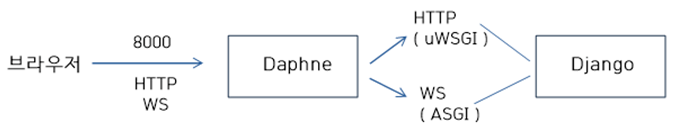

# 1. channels 서버배포

Django channels를 이용해 HTTP와 WS통신을 모두 사용하는 경우 아래 그림과 같이 ASGI를 처리해 줄 서버가 필요하다. 해당 글에서는 Nginx, Daphne, Gunicorn, EC2를 사용하여 서버를 배포하도록 하겠다.



> Daphne로 돌아가는 구조 | 출처: https://victorydntmd.tistory.com/265


## 1.1 설치

Channels와 Daphne의 경우 버전 호환성 이슈가 있는데, 다음과 같이 설치하면 이슈를 임시적으로 벗어 날 수 있다.

```bash
$ pip install channels daphne==2.2.5 asgiref=3.2.10
```


## 1.2 로컬 설정 및 동작확인

서버에 배포하기 전에 먼저 로컬에서 daphne서버로 백엔드를 돌려보자. Django를 설치하고 설정폴더를 보면 `wsgi.py`라는 파일이 있는데, 추가로 `asgi.py`를 만들어주어야 한다.

```python
# asgi.py

"""
ASGI entrypoint. Configures Django and then runs the application
defined in the ASGI_APPLICATION setting.
"""

import os
import django
from channels.routing import get_default_application

os.environ.setdefault("DJANGO_SETTINGS_MODULE", "{프로젝트이름}.settings")
django.setup()
application = get_default_application()
```


추가로 routing application으로 등록해주자. 여기서 `설정폴더이름`은 `asgi.py`를 포함하고 있는 디렉토리를 의미한다.

```python
# routing.py

ASGI_APPLICATION = "{설정폴더이름}.routing.application"
```


이제 daphne를 이용해서 서버를 구동해보자. 

```bash
$ daphne -p 8000 {설정폴더이름}.asgi:application

2020-08-09 13:06:53,049 INFO     Starting server at tcp:port=8000:interface=127.0.0.1
2020-08-09 13:06:53,049 INFO     HTTP/2 support not enabled (install the http2 and tls Twisted extras)
2020-08-09 13:06:53,050 INFO     Configuring endpoint tcp:port=8000:interface=127.0.0.1
2020-08-09 13:06:53,051 INFO     Listening on TCP address 127.0.0.1:8000
```


# 1.2 서버배포

Daphne에 정적파일 issue가 있는 관계로, 먼저 nginx와 gunicorn을 사용해 HTTP통신을 위한 배포를 진행하고, 리버스 프록시로 Daphne를 사용하도록 할 계획이다.

서버배포를 위해 github 혹은 gitlab에 Django프로젝트와 프론트엔드 빌드파일(dist)을 올리고 서버에서 clone하여 사용하도록 하자.

### 1.2.1 django vue 통합

> 이렇게 하면 새로고침 누르면 문제가 생긴다 ㅠㅠ 왠만하면 url을 구분해서 프록시로 나누자

필자는 `api/`와 같이 api url을 구분 하지 않는 경우, nginx에서 프록시 경로를 구분하는데 어려움이 있을 수 있다. 이를 해결하기위해 백엔드서버만 구동하면 앱을 사용할 수 있는 환경을 만들어주자. 이처럼 프론트서버를 배제하면 nginx설정이 간편해진다(물론 `api/`로 url을 구분한다면 이렇게 할 필요는 없다).

백엔드 서버만으로 앱을 돌리기위해서는 `yarn build`의 결과물인 `dist`폴더가 필요하다. `dist`폴더의 구조를 깔끔하게 하기 위해 다음과 같이 설정해주자. 아래와 같이 설정하면 css, img, js의 폴더가 static폴더안에 들어가게 된다.

```js
// vue.config.js
module.exports = {

  ...
    
  outputDir: './dist/',
  assetsDir: 'static',
};


```


설정 후 `dist`폴더를 생성해주자.

```bash
$ yarn build
```


Django에서 `index.html`을 Vue의 것을 쓸 수 있도록 설정하자.

```python
# settings.py

...

FRONTEND_DIR = os.path.join(BASE_DIR, '../frontend') # 프론트엔드 폴더 경로에 맞게 변경

STATICFILES_DIRS = [
    os.path.join(FRONTEND_DIR, 'dist/static'),
]

TEMPLATES = [
    {
        'BACKEND': 'django.template.backends.django.DjangoTemplates',
        'DIRS': [os.path.join(FRONTEND_DIR, 'dist')], # 이 부분만 변경
        'APP_DIRS': True,
        'OPTIONS': {
            'context_processors': [
                'django.template.context_processors.debug',
                'django.template.context_processors.request',
                'django.contrib.auth.context_processors.auth',
                'django.contrib.messages.context_processors.messages',
            ],
        },
    },
]
```


이렇게 진행 후 Django서버를 돌리면 다음과 같이 8000포트만을 이용해 서버를 돌릴 수 있다. 프론트서버의 url은 사용할 수 없으므로 라우팅만을 이용해야 한다.


> 8000 포트만으로 구동되는 앱


### 1.2.2 github 업로드

서버에 올리기 전, 먼저 static 데이터를 모으고 올려주자! WSGI를 통해서 서비스를 하게 될 경우 꼭 해주어야한다 (static폴더가 없는 경우 장고 템플릿의 정적파일 적용이 되지 않음).

```python
# settings.py

...

STATIC_ROOT = os.path.join(BASE_DIR, 'static/')

```

```bash
$ python manage.py collectstatic
```


