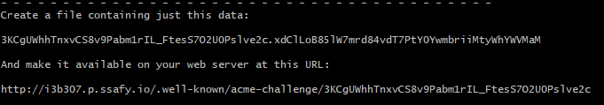
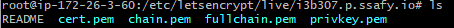
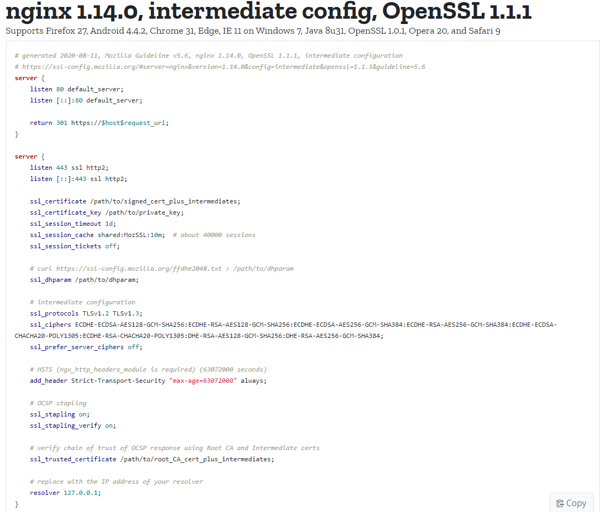

# 1. HTTPS 적용하기

HTTPS(Hypertext Transfer Protocol Secure)는 기존의 HTTP에서 보안성을 더한 프로토콜로, 비대칭 암호화 통신을 통해 데이터를 탈취 당하더라도 내용이 유출되지않는 장점을 가지고 있다. 비대칭 암호화 방식은 암호화와 복호화의 키가 다른 방식을 의미하는데, 송신자의 신원을 보장하기위해 공개키와 함께 CA(Certification Authority)의 서명을 보낼 필요가 있다. 수신자는 공개키 + 서명을 받고, 내용을 암호화해서 전송하고 송신자는 비공개키를 이용해 복호화를 하게 되는 방식이다.

이 서명을 SSL인증서라고 하는데, 원래는 인증된 기관(CA)로 부터 발급 받아야 하지만 이 문서에서는 Let's Encrypt를 통해 무료로 인증서를 받고 적용해보도록 하겠다.


## 1.1 인증서 발급

Let's Encrypt로 부터 .pem파일을 발급 받도록 하자. 먼저 github에서 clone을 한다.

```bash
$ git clone https://github.com/letsencrypt/letsencrypt
```


인증서 발급에는 유효한 도메인이 필요하므로, 도메인이 없는 경우 ngork을 사용하여 임시 도메인을 포트포워딩해서 사용하자. 다음 명령어를 사용해서 인증서를 발급받자.

```bash
$ ./letsencrypt-auto certonly --manual --email{이메일} {도메인}
```

> letsencrypt File "/usr/lib/python2.7/subprocess.py", line 190, in check_call 와 같이 에러가 발생할 경우 환경 변수를 추가해주자.
>
> ```bash
> $ export USE_PYTHON_3=1
> ```


이후 `A` -> `N` -> `Y` 순으로 입력해주면 다음과 같은 메세지가 출력된다. 2번째줄에 있는 파일내용과 4번째줄의 파일경로를 주목하자.



> **인증서 파일의 내용과 발급될 경로**


`Enter`를 누르지 말고, 터미널을 추가로 열어 디렉토리와 파일을 만들어주자.

```bash
$ mkdir -p /usr/share/nginx/html/.well-known/acme-challenge
$ vi /usr/share/nginx/html/.well-known/acme-challenge/3KCgUWhhTnxvCS8v9Pabm1rIL_FtesS7O2U0Pslve2c
```


파일에는 위 사진의 파일내용을 작성해준다.

```bash
# /usr/share/nginx/html/.well-known/acme-challenge/3KCgUWhhTnxvCS8v9Pabm1rIL_FtesS7O2U0Pslve2c

3KCgUWhhTnxvCS8v9Pabm1rIL_FtesS7O2U0Pslve2c.xdClLoB85lW7mrd84vdT7PtY0YwmbriiMtyWhYWVMaM
```


nginx를 사용하는 경우 nginx설정에 다음과 같이 추가해주자. 방금 설정한 파일을 url에 맞게 호출할 수 있도록 하는 설정이다. 이 설정을 하지 않으면 unauthorized 에러가 발생할 수 있다.

```bash
location ^~ /.well-known/acme-challenge/ {
        default_type "text/plain";
        root /usr/share/nginx/html;
}
```


원래 터미널로 가서 `Enter`를 누르면 다음과 같이 키가 생성된다.



> **생성된 키들**


## 1.2 설정

이제 발급받은 키를 사용해 nginx에 적용을 하는일만 남았다. [Mozila SSL Configuration Generator](https://ssl-config.mozilla.org/#server=nginx&version=1.14.0&config=intermediate&openssl=1.1.1&guideline=5.6)에서 nginx와 ssl 버전을 입력하면 config예시를 볼 수 있으므로 참고하자.

버전을 확인하는 명령어는 다음과 같다.

```bash
$ nginx -v
or 
$ sudo nginx -v
$ openssl version
```



> **Mozilla ssl config gen의 결과**


