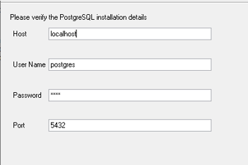
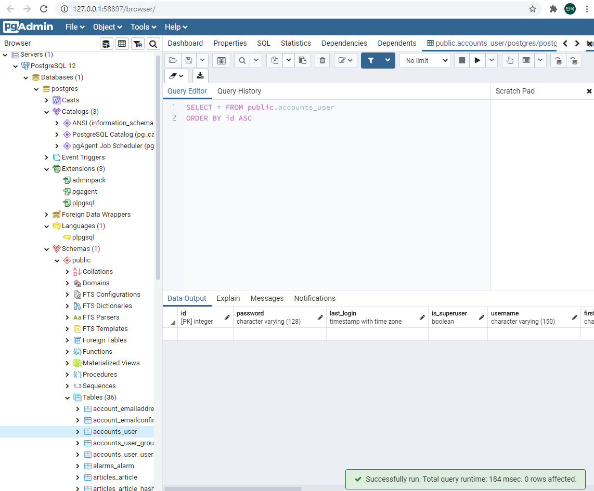

# 1. Django PostgreSQL 사용하기

Django에서는 기본적으로 sqlite3를 지원하지만, sqlite3는 대규모 프로젝트에 적합하지 않으므로 DB를 변경할 필요성이 있다. 원래는 mysql을 사용할 예정이였지만, mysql을 사용하기 위해 사용하는 모듈인 mysql-client를 설치하는데 이슈가 있어 PostgreSQL을 사용하게 되었다.


# 1.1 postgreSQL 설치

윈도우의 경우 docker를 사용하거나, 직접 설치하는 두가지 방식이 있고 리눅스는 yum, apt-get등을 이용해서 설치 할 수 있다. 해당 문서에서는 윈도우 환경과 리눅스 환경에서 설치하는 것을 모두 다뤄보도록 하겠다.

### 1.1.1 윈도우 설치

[PostgreSQL 다운로드 페이지](https://www.enterprisedb.com/downloads/postgres-postgresql-downloads)를 통해 손쉽게 다운로드가 가능하다. 

설치 도중 다음과 같은 설정입력이 나오는데 꼭 입력값을 기억하도록 하자.



> **설치 시 입력하는 설정**

또한 pgadmin4를 설치할 지 라디오 버튼을 통해 선택할 수 있으므로 필요하다면 선택하도록 하자. pgadmin은 다음과 같이 브라우저에서 DB를 조작하는 gui를 제공한다.



> **PostgreSQL을 위한 GUI 환경인 pgadmin4**

그리고 Django에서 연결하기위한 모듈인 `psycopg2`를 설치해주자.

```bash
$ pip install psycopg2
```


### 1.1.2 리눅스 설치

리눅스 설정은 루트 비밀번호를 설정하는 과정이 필요하고, psycopg2를 설치하는데 이슈가 있기 때문에 윈도우에 비해 조금 더 복잡하다.

먼저 apt-get을 통해 설치를 진행하자.

```bash
$ sudo apt-get install postgresql postgresql-contrib
```

> 아래의 모듈들을 설치하지 않으면 후에 `psycopg2`를 설치하는데 문제가 발생하므로 추가로 설치해주자.
>
> $ sudo apt-get install python-psycopg2
>
> $ sudo apt-get install libpq-dev


다음의 명령어를 사용하면 PostgreSQL을 사용할 수 있다.

```bash
$ psql -U postgres
or
$ sudo -i -u postgres
```


만약 여기서 비밀번호를 요구한다면 클라이언트 인증 파일인 `pg_hba.conf`파일을 조작하여 설정해야한다. `pg_hba.conf`의 경로는 다음과 같다. 도중에 `10`은 버전을 의미하므로 다를 수 있음에 유의하자.

비밀번호 없이 PostgreSQL에 접속하기 위해 마지막 세줄의 `peer`, `md5`를 `trust`로 변경해주자.

> 추가로 첫 줄이 `local all postgres peer`와 같이 작성이 되어있는데 Django와의 연결을 위해 `peer`를 `md5`로 변경하자.

```bash
$ sudo vim /etc/postgresql/10/main/pg_hba.conf

local   all             postgres                                md5 # 변경됨

# TYPE  DATABASE        USER            ADDRESS                 METHOD

# "local" is for Unix domain socket connections only
local   all             all                                     trust
# IPv4 local connections:
host    all             all             127.0.0.1/32            trust
# IPv6 local connections:
host    all             all             ::1/128                 trust
# Allow replication connections from localhost, by a user with the
# replication privilege.
local   replication     all                                     trust # 변경됨
host    replication     all             127.0.0.1/32            trust # 변경됨
host    replication     all             ::1/128                 trust # 변경됨

```


파일을 변경하고 나면 비밀번호 없이 접속이 가능해진다. 다음과 같이 `postgres=#`가 나오면 성공이다.

```bash
$ psql -U postgresql
psql (10.12 (Ubuntu 10.12-0ubuntu0.18.04.1))
Type "help" for help.

postgres=#
```


이제 비밀번호를 설정해주자.

```sql
postgres=# alter user {유저이름} with password '{비밀번호}'
```


변경 후, `pg_hba.conf`파일을 다시 복구하자. 다음과 같이 변경하면 된다.

```bash
# pg_hba.conf

local   all             postgres                                md5

# TYPE  DATABASE        USER            ADDRESS                 METHOD

# "local" is for Unix domain socket connections only
local   all             all                                     trust
# IPv4 local connections:
host    all             all             127.0.0.1/32            trust
# IPv6 local connections:
host    all             all             ::1/128                 trust
# Allow replication connections from localhost, by a user with the
# replication privilege.
local   replication     all                                     peer # 변경됨
host    replication     all             127.0.0.1/32            md5 # 변경됨
host    replication     all             ::1/128                 md5 # 변경됨
```


이제 Django와의 연결을 위해 `psycopg2`를 설치해주자.

```bash
$ pip install psycopg2
```


리눅스의 경우 데몬을 이용해 백그라운드로 동작하게하자.

```bash
$ sudo systemctl start postgresql
```


## 1.2 설정과 마이그레이션

Django에서 어떤 DB를 사용할지는 `settings.py`의 `DATABASES`에 의해 정해진다. 기존의 sqlite3를 PostgreSQL로 변경할 필요가 있다. 여기서는 `NAME`과 `USER`를 postgres로 사용했지만, 원하는대로 변경가능하다. 설정을 보면 포트가 명시되지 않은 것을 볼 수 있는데 default인 5432에서 변경하지 않은 경우 생략가능하다.

```bash
# settings.py

...

DATABASES = {
    'default': {
        'ENGINE': 'django.db.backends.postgresql',
        'NAME': 'postgres',
        'USER': 'postgres',
        'PASSWORD': '{비밀번호}',
    }
}
```


이제 migration을 만들고 migrate를 하면 DB에 테이블이 생성된다.

```bash
$ python manage.py makemigrations
$ python manage.py migrate
```


