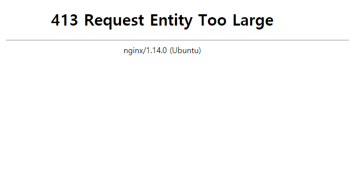

# 1. 이미지 업로드 크기제한 설정하기

Nginx, Django, Vue 등을 사용하는 프로젝트에서 이미지 크기에 따라 업로드가 되지 않는 버그가 발생했다. 설정이 필요한 부분은 크게 두 가지였다.


## 1.1 Nginx 설정

이미지 업로드를 하며 처음 발견한 에러는 413에러였다. 413에러는 Nginx에서 설정되어있는 파일 크기 제한을 넘어설 때 발생하는 에러로 설정파일에서 제한을 변경해주어야한다.



> **413에러**


Nginx의 `default` 파일과 `conf`파일에 다음과 같이 파일 크기를 설정해주자. 여기서 10M은 10MB를 의미한다.

```bash
# /etc/nginx/sites-available/default

server {
	...
	
	client_max_body_size 10M;
}
```

```bash
# /etc/nginx/nginx.conf

http {
	...
	
	client_max_body_size 10M;
}
```


## 1.2 Django설정

Nginx에서 파일 크기 제한을 바꾸고 나서도, 업로드 후에는 403에러와 함께 엑박(혹은 회색 박스)로 이미지가 나타나는 현상이 발생했다.

이는 Django에서도 허용되는 파일의 크기가 설정되어있기 때문인데, default는 2.5MB정도로 보인다.

변경을 위해 `settings.py`에 다음과 같은 코드를 추가해주자.

```bash
# settings.py

...

FILE_UPLOAD_MAX_MEMORY_SIZE=10000000
```

