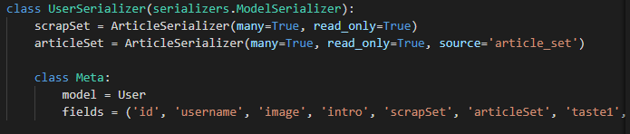
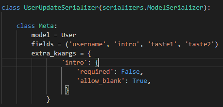

# 1. serializer 필드에 속성 적용하기

 Django에서 serialzer를 사용하던 도중, 모델에 정의된 속성들의 `required`, `allow_blank`등을 설정 할 필요성이 생겼다.

실제로 serializer를 정의 할 때 다른 serializer를 통해 필드를 추가하는 경우는 `required`와 같은 속성을 다음과 같이 `True`, `False`로 적용 할 수 있지만 serializer의 주 모델의 필드에는 적용 할 방법을 모르고 있었다.

> **다른 serializer로 부터 추가한 필드, 속성 적용이 간단**

기존 모델의 속성부여도 복잡하지 않았는데 다음과 같이 `extra_kwargs`를 작성해주면 된다.

> **기존 필드의 속성적용**

