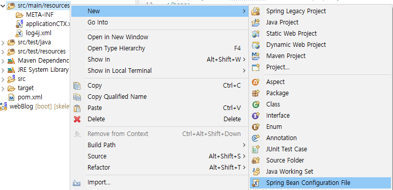

# 1. DI

DI(Dependency Injection)은 스프링의 특징 중 하나로 객체의 프로퍼티인 객체를 생성자나 세터(setter)를 이용해서 주입하는 것을 의미한다. DI를 사용하는 이유는 객체 간의 결합도를 낮추는 것인데 이로인해 유지보수가 좋은 코드를 만들 수 있다.

가장 많이 사용되는 예시가 일체형 배터리와 분리형 배터리인데, 일체형 배터리의 경우 배터리를 교체할 때 배터리와 제품의 높은 결합도로 인해 교체에 비교적 많은 비용이 들어간다. 하지만 분리형 배터리의 경우 간단히 분리하고 교체 후 다시 삽입(DI의 개념)하는 식으로 손쉽게 교체를 할 수 있다.


## 1.1 예시

해당 예시에서는 실질적인 계산의 기능을 하는 클래스인 `Calculation`과 `Calculation`와 피연산자를 프로퍼티로 가지는 `MyCalculator`라는 클래스로 진행한다.

아래의 코드는 스프링의 특징이 들어가지 않은 코딩방식이다. `Main.java`코드 내에서 각각의 객체를 생성하고 `setter`를 이용해 값을 넣었다.

```java
public class Main {

	public static void main(String[] args) {
		// TODO Auto-generated method stub
	  MyCalculator myCalculator = new MyCalculator();
	  myCalculator.setCalculator(new Calculation());
	  myCalculator.setFirstNum(10);
	  myCalculator.setSecondNum(2);
	  
	  myCalculator.add();
	  myCalculator.sub();
	  myCalculator.mult();
	  myCalculator.div();
	}
}
```


위의 코드에서 `setter`에 들어갈 객체들을 변경하기 위해서는 `java`코드를 직접 고쳐줘야하지만 스프링에서는 `xml`이라는 스프링 설정파일의 형식으로 이를 고칠 수 있도록 도와준다. 즉, 변경사항이 있어도 `java`코드를 변경하지 않아도 된다.

`xml`을 이용해서 DI를 하기위해 먼저 파일을 생성해주자. `src/main/resources`에 생성하면 된다.



> **xml파일생성**


`xml`을 생성하면 `bean`이라는 태그를 볼 수 있는데 `bean`은 JAVA의 프로퍼티와 메소드로 이루어진 클래스로 반복적인 작업을 효율적으로 사용하기 위해 사용한다.

우리는 `Calculation`과 `MyCalculation`객체가 필요하므로 `xml`에서 두개의 `bean`을 만들어주자.


### 1.1.1 property 주입

```xml
<?xml version="1.0" encoding="UTF-8"?>
<beans xmlns="http://www.springframework.org/schema/beans"
	xmlns:xsi="http://www.w3.org/2001/XMLSchema-instance"
	xsi:schemaLocation="http://www.springframework.org/schema/beans http://www.springframework.org/schema/beans/spring-beans.xsd">

	<bean id="calculation" class="com.min.test.Calculation"></bean>
	
	<bean id="myCalculator" class="com.min.test.MyCalculator">
	  <property name="calculator" ref="calculation"></property>
	  <property name="firstNum" value="15 "></property>
	  <property name="secondNum" value="5"></property>
	</bean>
</beans>
```


`bean`을 보면 `id`와 `class`가 있는데, `id`는 `xml`파일 내에서 사용 될 해당 `bean`의 이름이고, `class`는 외부의 클래스를 `bean`에 적용하는 형태이다.

앞서 말한대로 `xml`에서 `setter`의 역할을 하게 되는데 `property`라는 태그를 사용해서 값을 설정할 수 있다. 이 때 객체의 경우는 `ref`라는 속성을 사용한다.


### 1.1.2 생성자 주입

```xml
<?xml version="1.0" encoding="UTF-8"?>
<beans xmlns="http://www.springframework.org/schema/beans"
	xmlns:xsi="http://www.w3.org/2001/XMLSchema-instance"
	xsi:schemaLocation="http://www.springframework.org/schema/beans http://www.springframework.org/schema/beans/spring-beans.xsd">

	<bean id="calculation" class="com.min.test.Calculation"></bean>
	
	<bean id="myCalculator" class="com.min.test.MyCalculator">
	  <constructor-arg ref="calculation"></constructor-arg>
	  <constructor-arg value="10"></constructor-arg>
    <constructor-arg value="10"></constructor-arg> 
	</bean>
</beans>
```


위의 방식은 생성자를 이용해서 주입하는 방법이다. `constructor-arg`라는 태그를 사용해서 클래스의 생성자에 정의된 순서대로 값을 넣어주어야 하며 생성자가 정의 되어있는지 확인해야한다.


이제 `Main.java`를 확인해보자. `xml`의 `bean`을 사용하여 객체를 선언하고 주입하므로 위의 코드는 변경없이 사용할 수 있게된다.

```java
public class Main {

	public static void main(String[] args) {
		// TODO Auto-generated method stub
	  String configLoc = "classpath:applicationCTX.xml";
	  AbstractApplicationContext ctx = new GenericXmlApplicationContext(configLoc);
	  MyCalculator myCalculator = ctx.getBean("myCalculator", MyCalculator.class);
	  
	  myCalculator.add();
	  myCalculator.sub();
	  myCalculator.mult();
	  myCalculator.div();
    ctx.close();
	}
}
```

