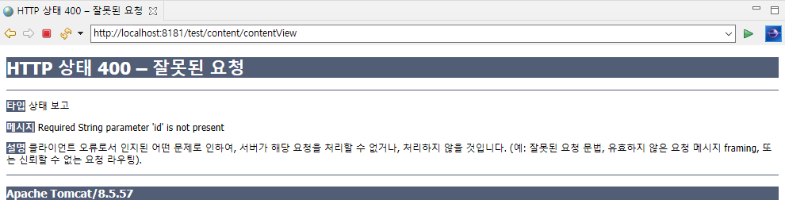

# 1. Controller

Controller는 MVC패턴에서 model에 접근하고 logic에 따른 데이터를 View에 전달하는 부분으로, Django의 MVT패턴에서 View에 해당하는 파트이다. 해당문서에서는 Django에 대응하여 Spring에서는 어떤식으로 동작하는지에 대해서 기술한다.

Controller의 역할은 요청으로 들어온 Url을 메소드와 Mapping하고 logic을 구현한 뒤, 특정 html 또는 jsp에 데이터를 전달하거나 JSON등의 형태로 응답하는 것이다.


## 1.1 Url mapping

Django에서는 각 앱마다  `urls.py`라는 파일이 존재하고, 요청이 들어오면 해당 파일에서 클래스나 함수로 mapping을 해주었다. Spring에서는 url mapping이 여러번 일어나는데 가장 먼저 `DispatcherServlet`이라는 부분에서 이뤄진다.

이 때 일어나는 mapping은 사용할 Controller를 정하는 것으로, 먼저 Controller가 무슨 역할을 하는지 알아 볼 필요가 있다.

Spring에서의 Controller는 클래스에 `@Controller`라는 Annotation을 붙이므로서 정의되는데,  Django에서의 `urls.py`에서의 mapping과 `views.py`의 함수의 기능을 한번에 하는것이 Controller이다. 즉 Controller에서 요청에 대한 url mapping을 하고 logic을 구현하며 응답을 처리한다. 간단한 Controller는 다음과 같은 형태를 가지게 된다.

```java
package com.min.test;

import org.springframework.stereotype.Controller;
import org.springframework.ui.Model;
import org.springframework.web.bind.annotation.RequestMapping;

@Controller
public class MyController {

  @RequestMapping("/view")
  public String view() {
    
    return "view";
  }
}
```


위의 코드는 `@RequestMapping` annotation을 사용해 `/view`로 들어오는 요청을 `view()`라는 메소드와 매핑, 리턴하는 String인 `view` 는 어딘가의 `view.jsp`를 사용자에게 응답하겠다는 의미를 가진다.

이제 Controller에 대해 어느정도 이해했으니 실제로 어떻게 동작하는지 알아보자.

먼저 요청은 앞서 언급한 `DispatcherServlet`에서 먼저 처리된다.  해당 Servlet은 요청을 처리하기 위해 Handler를 호출해 요청에 맞는 Controller를 찾거나 Model과 View의 처리 등 다양한 기능을 지원한다. 흐름을 알기위해 `web.xml`을 살펴보자.

```xml

	...

	<!-- Processes application requests -->
	<servlet>
		<servlet-name>appServlet</servlet-name>
		<servlet-class>org.springframework.web.servlet.DispatcherServlet</servlet-class>
		<init-param>
			<param-name>contextConfigLocation</param-name>
			<param-value>/WEB-INF/spring/appServlet/servlet-context.xml</param-value>
		</init-param>
		<load-on-startup>1</load-on-startup>
	</servlet>
		
	<servlet-mapping>
		<servlet-name>appServlet</servlet-name>
		<url-pattern>/</url-pattern>
	</servlet-mapping>

</web-app>
```


`web.xml`을 보면 `appServlet`이라는 이름으로 Servlet을 정의하고 `/`로 들어오는 모든 요청을 제어하는 것을 확인할 수 있다. 또한 이에 대한 설정은 `/WEB-INF/spring/appServlet/servlet-context.xml`라는 경로에서 이루어진다는 것을 확인할 수 있다. 이 경로를 확인해보자.

```xml

	...

	<!-- DispatcherServlet Context: defines this servlet's request-processing infrastructure -->
	
	<!-- Enables the Spring MVC @Controller programming model -->
	<annotation-driven />

	<!-- Handles HTTP GET requests for /resources/** by efficiently serving up static resources in the ${webappRoot}/resources directory -->
	<resources mapping="/resources/**" location="/resources/" />

	<!-- Resolves views selected for rendering by @Controllers to .jsp resources in the /WEB-INF/views directory -->
	<beans:bean class="org.springframework.web.servlet.view.InternalResourceViewResolver">
		<beans:property name="prefix" value="/WEB-INF/views/" />
		<beans:property name="suffix" value=".jsp" />
	</beans:bean>
	
	<context:component-scan base-package="com.min.test" />

	...

```


구체적으로 url이 어떻게 쓰이는지에 대해 작성되어있다. 이미지와 같은 static파일을 사용하는 경우 `/resources/`와 같은 경로로 처리를 하고, 다른 경로로 들어온 요청은 앞에 `/WEB-INF/views/`을 붙이고 뒤에 `.jsp` 붙여 jsp를 응답하는 방식으로 구현이 되어있다. 

앞서 Controller내 메소드에서 String을 리턴했던 이유가 바로 이것 때문이다. 만약 `view`라는 String을 return하면 `ViewResolver`는 해당 String을 `/WEB-INF/views/view.jsp`같이 접두, 접미를 붙여 jsp를 찾고 응답을 하게 된다.

이 때, `context:componet-scan`이라는 태그로 등록된 패키지에서만 Controller를 찾으므로 주의하도록 하자.


## 1.2 jsp에 모델 전달하기

Django에서는 html에 데이터를 전달할 때 `context`라는 dict를 만들어 사용했다. Spring에서는 model이라는 객체에 데이터를 넣는 방식으로 전달을 한다.


#### model만 사용

아래와 같이 model 객체에 Attribute를 추가해주고, jsp에서 `${}`안에 Attribute를 넣어주면 사용할 수 있다.

```java
@Controller
@RequestMapping("/content")
public class MyController {
  
  @RequestMapping("/contentView")
  public String contentView(Model model) {
    
    model.addAttribute("id", "54645");
    return "content/contentView";
  }
}
```

```xml
<!-- contentView.jsp -->

<%@ page language="java" contentType="text/html; charset=EUC-KR"
    pageEncoding="EUC-KR"%>
<!DOCTYPE html>
<html>
<head>
<meta charset="EUC-KR">
<title>Insert title here</title>
</head>
<body>
  <p>contentView page</p>
  id: ${id} 
</body>
</html>
```


#### ModelAndView를 사용

위 방식과 크게 다르지 않지만 `ModelAndView`객체를 생성하고 해당 객체를 리턴하는 방식으로 사용한다. `ModelAndView`객체에는 전달할 데이터와 View의 이름 등을 넣는다.

```java
package com.min.test;

import org.springframework.stereotype.Controller;
import org.springframework.ui.Model;
import org.springframework.web.bind.annotation.RequestMapping;
import org.springframework.web.servlet.ModelAndView;

@Controller
@RequestMapping("/content")
public class MyController {
  
  @RequestMapping("contentModelAndView")
  public ModelAndView contentModelAndView() {
    
    ModelAndView mv = new ModelAndView();
    mv.addObject("id", "12345");
    mv.setViewName("/content/contentModelAndView");
    
    return mv;
  }
}
```


## 1.3 요청인자 사용하기

Spring에서는 요청인자(request)를 두가지 방식으로 사용할 수 있다. `HttpServletRequest`객체와 `@RequestParam`인데 후자의 경우 요청으로부터 값이 넘어오지 않는 경우 400에러가 발생한다.


#### HttpServletRequest

Django에서의 request객체와 같이 사용된다. 사용예시를 보면 빠르게 이해할 수 있다.

```java

	...
    
@Controller
@RequestMapping("/content")
public class MyController {
  
  @RequestMapping("/contentView")
  public String contentView(HttpServletRequest httpServletRequest, Model model) {
    
    String id = httpServletRequest.getParameter("id");
    model.addAttribute("id", id);
    return "/content/contentView";
  }
}
```


#### @RequestParam

마찬가지로 사용예시를 보면 빠르게 이해할 수 있다.

```java

	...

@Controller
@RequestMapping("/content")
public class MyController {
  
  @RequestMapping("/contentView")
  public String contentView(@RequestParam("id") String id, Model model) {
    
    model.addAttribute("id", id);
    return "/content/contentView";
  }
}
```


`@RequestParam`의 경우, 요청에 해당 데이터가 없으면 다음과 같은 에러가 발생한다.



> **400에러**


#### 데이터 객체

요청으로 받는 데이터가 많은 경우 데이터 객체를 사용하여 간단하게 사용할 수 있다. 

```java

	...

import com.min.member.Member;

@Controller
@RequestMapping("/content")
public class MyController {
  
  @RequestMapping("/contentView")
  public String contentView(Member member) {
    
    return "/content/contentView";
  }
}
```


데이터 객체를 사용하면 위와 같이 코드를 간소화할 수 있는데, 이를 위해선 클래스를 만들어 주어야한다. 해당 예제에서는 `id`와 `name`을 받기 위해 간단한 클래스를 생성했다.

```java
// com.min.member.Member.java

package com.min.member;

public class Member {

  private String name;
  private String id;
  
  public String getName() {
    return name;
  }
  public void setName(String name) {
    this.name = name;
  }
  public String getId() {
    return id;
  }
  public void setId(String id) {
    this.id = id;
  }
}
```


jsp에서는 다음과 같이 객체로 접근을 해주면 된다.

```xml
<%@ page language="java" contentType="text/html; charset=EUC-KR"
    pageEncoding="EUC-KR"%>
<!DOCTYPE html>
<html>
<head>
<meta charset="EUC-KR">
<title>Insert title here</title>
</head>
<body>
  <p>contentView page</p>
  name: ${member.name}
  id: ${member.id} 
</body>
</html>
```


## 1.4 @PathVariable

Django에선 Variable routing이라고 불렸던 개념으로 url에 변수값을 넣어 사용하는 방식이다. Spring에서는 `@RequestMapping`과 `@PathVariable` annotation을 사용해 구현한다.

```java
@Controller
@RequestMapping("/content")
public class MyController {
  
  @RequestMapping("/contentView/{id}")
  public String contentView(@PathVariable String id, Model model) {
    
    model.addAttribute("id", id);
    return "/content/contentView";
  }
```


